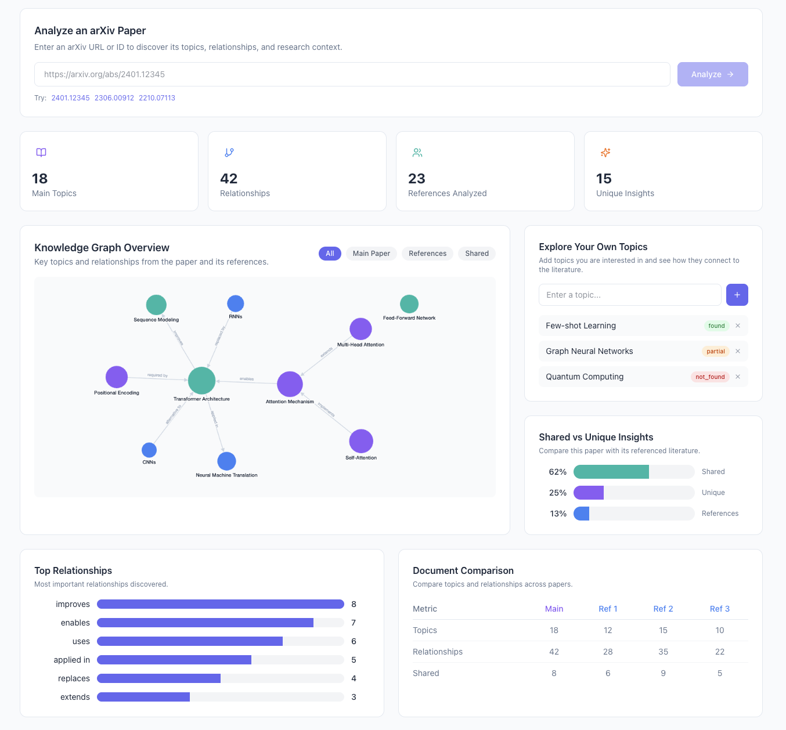
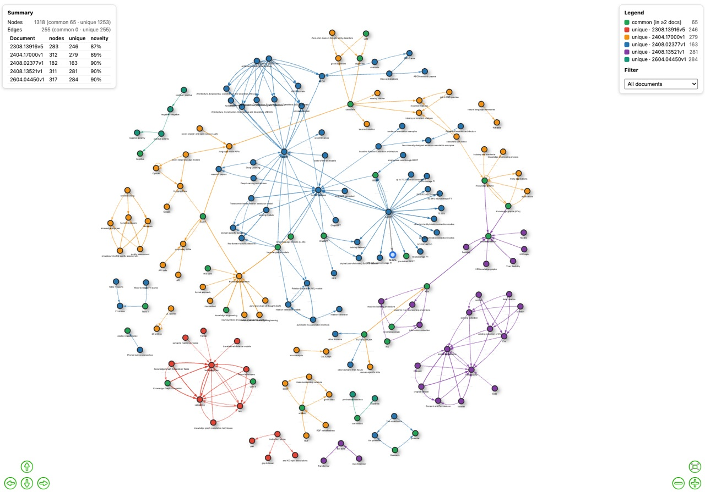

# Astrolabe

An instrument that maps the state of the art of any research topic as a knowledge graph — and points at what is original and what is missing.



> **Full technical docs:** the docs are their own project at the repo root (see `pyproject.toml`). Build and browse with `uv sync && uv run mkdocs serve`, or read the sources under [`docs/`](docs/).

## The problem

Knowing the *state of the art* of any topic is hard. Research piles up fast (arXiv, IEEE, RSS feeds...) and most papers say the same thing in different words. Reading it all — or asking an LLM to summarize it — doesn't scale and doesn't accumulate: an LLM has no persistent memory of everything published on a topic, and lexical similarity misses cases where the *wording* is new but the *idea* isn't — or the reverse, where the wording is generic but the combination of ideas genuinely is new. On top of that, researchers need to spot what has **not** been done yet: the gaps worth exploring.

## The idea

<table>
<tr>
<td width="70%">

Build an **accumulated knowledge graph per topic** from the actual research sources (arXiv, IEEE), and use it to answer three questions:

1. **What is the state of the art?** — the structure of the topic graph (the concepts and how they relate, their confidence and frequency) is a map of the field as it stands today.
2. **What is original?** — a new paper, post, or idea is compared against the accumulated topic graph: novel nodes, novel edges, and novel combinations stand out structurally even when the wording is similar to prior work.
3. **What is missing?** — the graph exposes **gaps**: concepts and relations that are rare or absent, which become inspiration for unexplored directions.

</td>
<td width="30%" align="center">


</td>
</tr>
</table>

```
topic search (arXiv/IEEE) → concept extraction → relation extraction → accumulated topic graph
                                                                        │
                            ┌───────────────────────────────────────────┤
                            │                                           │
                  new paper/idea                             user idea as a GLiNER label
                            │                                           │
                            ▼                                           ▼
                 compare against                             does that label appear
                 accumulated topic graph                     in any document? (GLiNER)
                            │                                           │
                            ▼                                           ▼
                 originality signal                     originality / state-of-the-art pattern
```

The user-facing loop is powerful and cheap: because GLiNER is zero-shot, **any topic that occurs to the user becomes a label** and we can ask directly "does this idea appear in any document of the corpus, and how is it connected?" — a live originality check against the state of the art, plus the graph shows which related ideas exist around it.

Multi-document view of a corpus (`uv run corpus-demo` in `backend/`): every node/edge is labeled **common** (present in ≥2 documents, green) or **unique** to one document (originality view):



### What "not new" looks like

| Case | Node (concept) | Edge (relation) | Interpretation |
|---|---|---|---|
| Pure repetition | exists | exists | Recycled content, reworded |
| Novel combination | exists | new | Known ideas connected in a new way — often the most genuinely original case |
| New concept | new | — | Either real innovation, or invented jargon dressed up as novelty |

The "café recalentado" case — a post using different vocabulary to say something that's been said 50 times — shows up as **high structural similarity** (graph/WL-kernel level) even when **lexical similarity is low** (plain text embeddings). That's the gap this approach is meant to close: plain-text comparison alone misses it.

## Frontend

The **ArXiv Graph Explorer** is a React + TypeScript frontend that visualizes the knowledge graph interactively.

```bash
cd frontend && npm install && npm run dev
```

Open `http://localhost:5173`. The frontend connects to the FastAPI backend at `localhost:8000`.

Features:
- **Overview** — seed paper URL input (with citation-guided discovery), stats, knowledge graph, shared vs unique insights
- **Graph Explorer** — interactive Cytoscape.js graph with node inspection
- **Shared Insights** — concepts and relationships shared across documents
- **Originality** — unique contributions and potential research gaps
- **Research Gaps** — missing topics, missing relationships, underexplored combinations

## Pipeline

**Sources (implemented: arXiv)**
- **arXiv harvester** (`backend/src/kgraph/ingestion/arxiv.py`): topic query → `RawDocument`s with abstracts and metadata (title, authors, dates, `arxiv_id`, URLs), or full text via PDF download + docling parsing (`arxiv-demo --fulltext` writes `<arxiv_id>.md` per paper, re-feedable with `data_source.file_type: md`)
- **arXiv full text via ar5iv HTML (fast path)**: the citation-guided pipeline fetches seed and reference full text from **ar5iv** as semantic HTML (`section#bib` for the bibliography, `li.ltx_bibitem` for refs) instead of PDF+docling — much faster and needs no docling models. References are resolved in parallel (up to 8 workers).
- IEEE and similar sources plug in as extra `DataSource` implementations (planned)

**Citation-guided discovery (seed → references → state of the art)**
- `SeedPaperSource` + `ArxivReferenceExtractor` resolve the seed's references; Qwen (Ollama) reads each citing context and proposes concepts/types/relations, which become the GLiNER taxonomy
- GLiNER is loaded **once** from a process-wide cache and shared across every document/segment (no reload between analyses)
- Nodes are classified **core / seed-only / refs-only** as a cheap originality proxy

**Concept (entity) extraction**
- Adaptive KeyBERT → candidate topic seeds per document (adaptive count via score elbow)
- Topic-guided expansion (spaCy dependency parsing, LLM-free) → grows the seeds into a graph of topics and relations
- GLiNER → zero-shot entity + relation extraction using exactly those discovered topics/relations as labels (underscore-joined), with confidence scores
- Entity normalization & merging (`normalization.py`) collapses near-duplicates (`canonical`, token containment) before the final graph

**Relation extraction**
- spaCy dependency parsing (verb lemma + preposition, e.g. `obtained from`) → candidate relation phrases
- Kept only when an endpoint touches a known topic; new endpoints become topics to expand, up to `max_depth`
- GLiNER extracts the final relations between the extracted entities using the discovered relation labels, with confidence scores

**Accumulated graph & originality/gap signals** (planned)
- Weisfeiler-Lehman (WL) kernel, structural invariants, and/or semantic embedding similarity to score how much a new mini-graph diverges structurally from the accumulated topic graph
- New nodes / new edges relative to the accumulated graph become the raw originality signal; rare/absent concepts and relations are the **gap** candidates
- GLiNER zero-shot label check: query the corpus for a user-proposed idea and see whether it exists and how it connects

## Constraints / design choices

- No paid per-token LLM APIs in the pipeline; local/open models only (GLiNER — Apache 2.0; spaCy — MIT)
- Labels (both entity and relation types) are discovered from the data via deterministic dependency parsing, not hand-defined
- Discovery is deterministic and LLM-free (a small local model hallucinated evidence, so it was dropped from discovery)
- One accumulated graph per topic, growing over time as new content is processed — the comparison only gets more meaningful as the corpus grows

## Quick start

```bash
# Backend
cd backend && uv sync && uv run uvicorn kgraph.api.main:app --reload --port 8000

# Frontend (separate terminal)
cd frontend && npm install && npm run dev
```

Open `http://localhost:5173`.

## Status

Implemented: the **arXiv harvester** (`arxiv-demo`, abstracts or full text), Adaptive KeyBERT seeding, LLM-free topic-guided discovery (spaCy), the discovery-driven GLiNER assembly that builds the final knowledge graph (with **section-aware segmentation** beating the 1024-token window), and the **citation-guided discovery** path (seed → references → Qwen taxonomy → GLiNER) exposed through the API. Full text for the citation path is fetched fast from **ar5iv HTML** with parallel reference resolution. Current default corpus: `backend/data/case_2/medium.txt`.

Still open:
- **Source feed**: IEEE (and similar) harvesters are not implemented; the pipeline can read a local folder (`data_source` in `params.yaml`) or fetch from arXiv (`data_source.type: arxiv`).
- **Accumulated graph**: nodes/edges accumulate per topic across documents; today each run builds a fresh graph from one corpus.
- **Originality/gap signals**: the WL-kernel / embedding comparison against an accumulated topic graph, and the GLiNER zero-shot idea check, are designed but not yet implemented.
- **Granularity**: too fine-grained and everything looks "new"; too coarse and nothing ever registers as novel. Will likely need iteration once there's real data flowing through.
- **Scope of the accumulated graph**: per topic, per author, or both? An originality score per author (% of their output that maps to already-seen nodes/edges) is an interesting downstream product on top of the same graph.

The extraction pipeline reuses techniques prototyped in a separate insurance-claims knowledge graph project, applied here to a different domain.
