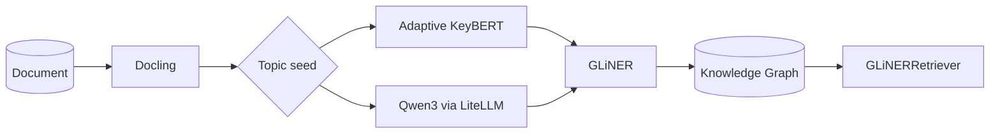

# Approach 1: Adaptive KeyBERT + GLiNER

> Updated to reflect the implemented pipeline (the original spaCy/BERTopic design was replaced by **KeyBERT** as the keyword source).



## Overview

A document goes through **topic discovery** and then **graph extraction**:

1. **Topic seed** — produce a small set of labels (keywords or concepts) that describe the document.
2. **Graph extraction** — GLiNER uses those labels as *entity types* and extracts entities + relations, which are assembled into a `networkx` graph.

The same GLiNER machinery runs regardless of the seed — only the labels change. That is the point of the experiment: how the *choice of topic seed* changes what the graph captures.

## Route A — Adaptive KeyBERT

`AdaptiveKeyBERT` (in `kgraph/extractors/key_bert.py`) replaces a fixed `top_n` with an **adaptive count** driven by two signals: document length and the shape of the similarity scores.

### The adaptive count algorithm

1. **Generous pool.** Ask KeyBERT for a wide pool of candidates (`use_maxsum=True` for diversity), scaled to document length:

   ```python
   est = round(n_words / words_per_kw)              # length signal
   pool = max(max_k, min(max_candidates, est))
   ```

2. **Noise floor.** Drop anything below `score_floor`.

3. **Elbow cutoff.** Look for the *knee* of the sorted similarity scores inside the `[min_k, max_k]` window, using the `kneed` library. The window itself is scaled by document length, so a 50-word text does not compete for the same range as a 2000-word one:

   ```python
   window = scores[min_k - 1 : min(max_k, len(scores))]
   knee = KneeLocator(x, window, curve="convex", direction="decreasing").knee
   cutoff = max(min_k, min(max_k, knee))
   ```

   The idea: KeyBERT's scores normally drop sharply at the point where "this describes the text" becomes "this is filler". The largest drop *within a bounded window* is a simple elbow heuristic; `kneed` makes the detection more robust to noise.

### Configuration

The adaptive behavior is configurable in `backend/configs/params.yaml` under `keyword_extractor.adaptive`:

| Key | Default | Meaning |
| --- | --- | --- |
| `min_k` | 2 | Minimum keywords to keep |
| `max_k` | 20 | Upper bound of the elbow search window |
| `words_per_kw` | 40 | Length scaling: ~1 keyword per N words |
| `score_floor` | 0.2 | Relevance threshold below which candidates are dropped |
| `max_candidates` | 25 | Cap on the generous pool requested from KeyBERT |

## Route B — Qwen3 via LiteLLM

`LiteLLMClient` (`kgraph/llms/litellm_client.py`) sends the document to a local **Qwen3** model (Ollama) and asks for *semantic concepts*. A Pydantic schema (`Concepts`) is enforced through `response_format` JSON-schema with `strict: true`, so the model answers in a structured, validated form.

Where KeyBERT returns document-local surface phrases (*"summit loan servicing"*, *"disputed late fee"*), Qwen returns abstract buckets (*"Loan Servicing Dispute"*, *"Credit Reporting"*).

## Graph extraction — GLiNER

`GLiNERGraph` (`kgraph/extractors/gliner.py`) builds the in-memory `networkx.MultiDiGraph`:

- **Entities** are deduplicated (case-insensitive) and merged across mentions; each node stores `text`, `entity_type`, `score` and `mentions`.
- **Relations** become edges between the two entities they mention, with `relation_type` and `score`.
- Indexes (`entity_text_index`, `entity_type_index`, `doc_index`) back the traversal methods.

## Retrieval — GLiNERRetriever

`GLiNERRetriever` (`kgraph/retriever/gliner.py`) answers queries by walking the graph:

1. Extract entities from the query (with a relaxed threshold).
2. Match them in the graph, then expand to neighbors up to `expansion_depth`.
3. Collect the relevant relations and the source documents behind them.

`format_context()` renders the result as LLM-ready context.

## Demos

| CLI entry | What it does |
| --- | --- |
| `uv run kbert-demo` | Runs Adaptive KeyBERT over the configured document and prints the chosen keywords |
| `uv run qwen-demo` | Runs Qwen3 concept extraction with structured output |
| `uv run gliner-demo` | Builds the graph with GLiNER and runs a retrieval query |

## Experiment — Exp 02 (Qwen vs KeyBERT)

`backend/experiments/exp_02_qwen_versus_keybert.ipynb` compares both routes on the same document (`data/case_1/mortgage.txt`):

- **Route A (KeyBERT)** → 12 entities / 13 relations. Compact, faithful to the text, but narrow.
- **Route B (Qwen)** → 21 entities / 15 relations. Broader abstraction, but GLiNER tags more granular spans.

Observations are recorded in the notebook; the comparison is intentionally informal — nothing conclusive yet.
