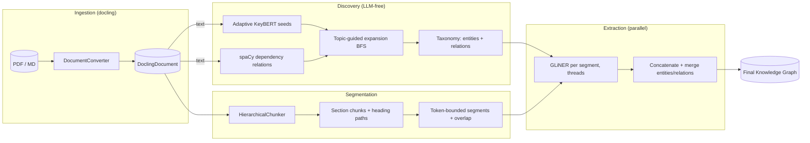
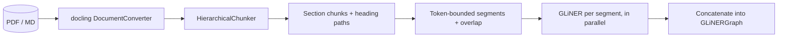

# Approach 1: Adaptive KeyBERT + Topic Discovery

> Updated to reflect the assembled pipeline: KeyBERT provides the topic seeds, a deterministic **LLM-free** discovery pass (spaCy dependency parsing) expands the relations and new topics from those seeds, and the discovered topics/relations become the label taxonomy handed to GLiNER to build the final knowledge graph.



## Overview — the general approach

The key idea: **KeyBERT provides the seeds, and from those seeds the pipeline discovers both the relations and the new topics — iteratively and without an LLM — and then uses exactly those discoveries as the entity/relation taxonomy for GLiNER, closing the loop between discovery and extraction.**

The design is a synthesis of two extremes that were both unsatisfactory on their own:

- **KeyBERT alone falls short** — it returns a handful of phrases and no relationships between them.
- **Extracting every subject-verb-object triple** (the naive spaCy approach) is too much — every sentence of the document produces edges, drowning the signal in noise.

The compromise is a **topic-guided expansion**: only the relations whose endpoints touch a *known* topic are kept, and each new endpoint becomes a topic that can be expanded in turn, up to a configured depth.

The pipeline has five stages:

1. **Seed stage** — `AdaptiveKeyBERT` extracts the initial topics from the document.
2. **Relation extraction** — spaCy parses the dependency tree of every sentence and derives relations from its verbs: subject → verb(+preposition) → object.
3. **Expansion** — a BFS from the seeds keeps only the relations touching a known topic, adds the other endpoint as a new node at `depth + 1`, and repeats until the queue runs dry or a limit is hit.
4. **Assembly** — the discovered node texts and edge relations become the `entities`/`relations` labels passed to GLiNER, which extracts the final knowledge graph.
5. **Segmentation** — long documents are split into token-bounded, section-aware segments (docling `HierarchicalChunker`) and GLiNER runs over every segment in parallel, concatenating the results into the graph (see Stage 5 below).

The discovery pipeline deliberately does **not** use GLiNER, embeddings, or any predefined relation taxonomy — the relation labels *emerge from the text*. GLiNER is the last stage only, once the taxonomy has been discovered.

### In one example

The first paragraph of the mortgage case:

> I obtained a mortgage loan of $285,000 from Meridian Home Lending in June 2021 for my property at 142 Oakwood Drive. The loan was originated with a fixed interest rate of 4.25% and a monthly payment of $1,650.

- **Seeds** (KeyBERT): `payments equifax`, `late fee`
- **Relations** (spaCy dependencies): `mortgage loan --obtain from--> Meridian Home Lending`, `loan --originate with--> fixed interest rate`
- **New topics**: the endpoints that were not seeds (`Meridian Home Lending`, `fixed interest rate`, ...) become expandable nodes at the next depth.

## Stage 1 — Adaptive KeyBERT (seeds)

`AdaptiveKeyBERT` (in `kgraph/extractors/key_bert.py`) replaces a fixed `top_n` with an **adaptive count** driven by two signals: document length and the shape of the similarity scores.

### The adaptive count algorithm

1. **Generous pool.** Ask KeyBERT for a wide pool of candidates (`use_maxsum=True` for diversity), scaled to document length:

   ```python
   est = round(n_words / words_per_kw)              # length signal
   pool = max(max_k, min(max_candidates, est))
   ```

2. **Noise floor.** Drop anything below `score_floor`.

3. **Elbow cutoff.** Look for the *knee* of the sorted similarity scores inside the `[min_k, max_k]` window, using the `kneed` library:

   ```python
   window = scores[min_k - 1 : min(max_k, len(scores))]
   knee = KneeLocator(x, window, curve="convex", direction="decreasing").knee
   cutoff = max(min_k, min(max_k, knee))
   ```

   The idea: KeyBERT's scores normally drop sharply at the point where "this describes the text" becomes "this is filler".

### Configuration

Under `keyword_extractor.adaptive` in `backend/configs/params.yaml`:

| Key | Default | Meaning |
| --- | --- | --- |
| `min_k` | 2 | Minimum keywords to keep |
| `max_k` | 20 | Upper bound of the elbow search window |
| `words_per_kw` | 40 | Length scaling: ~1 keyword per N words |
| `score_floor` | 0.2 | Relevance threshold below which candidates are dropped |
| `max_candidates` | 25 | Cap on the generous pool requested from KeyBERT |

## Stage 2 — Relation extraction (spaCy dependencies, no LLM)

`DependencyRelationExtractor` (in `kgraph/discovery/dependency_relations.py`) extracts relations from the dependency tree. For each sentence it takes the predicate verbs — the root verb plus verb complements/conjuncts (`xcomp`, `ccomp`, `conj`) — and derives the arguments from each verb:

```python
for sent in nlp(doc).sents:
    root = sent.root
    for verb in _verbs(root):        # root + xcomp / ccomp / conj
        subj = _subject(verb, root)  # nsubj / nsubjpass
        obj  = _object(verb)         # dobj, or pobj of a preposition
        label = f"{verb.lemma_} {prep}"   # "obtained from", "reported to"
```

Key rules:

- **Relation labels are auto-discovered.** The label is the verb lemma plus its preposition ("obtained from", "reported to", "charging"). There is no ontology — it emerges from the parse.
- **Pronoun subjects are dropped as nodes.** When the subject is a pronoun ("I obtained..."), the relation is re-anchored between the direct object and the prepositional object: *"I obtained a mortgage loan from Meridian Home Lending"* → `mortgage loan --obtained from--> Meridian Home Lending`.
- **Prepositions attached to nouns are also followed** (*"reported the missed payments **to Equifax**"*, where `to` hangs off `payments`).
- The **evidence** is always the sentence the relation was parsed from — it cannot be hallucinated because nothing generates it.

### A worked example

Sentences in, relations out:

```text
"I obtained a mortgage loan from Meridian Home Lending in June 2021."
  → mortgage loan --obtain from--> Meridian Home Lending
  → mortgage loan --obtain in--> June

"The servicing of my loan was transferred to Summit Loan Servicing."
  → servicing --transfer to--> Summit Loan Servicing

"Summit Loan Servicing reported the missed payments to Equifax."
  → Summit Loan Servicing --report--> missed payments
  → Summit Loan Servicing --report to--> Equifax        # 'to' hangs off the noun

"Summit Loan Servicing began charging me a late fee of $75."
  → Summit Loan Servicing --charge--> late fee          # 'charging' is xcomp of 'began'
```

Note what the rules do on the first example: the subject `I` is a pronoun, so the
relation is re-anchored between the object `mortgage loan` and the prepositional
object `Meridian Home Lending`, and the label becomes the verb lemma plus its
preposition (`obtain from`).

## Stage 3 — Topic-guided expansion (BFS)

`TopicGraph` (in `kgraph/discovery/topic_graph.py`) grows the graph from the seeds:

```python
queue = deque(seeds)                    # depth 0
while queue:
    topic = queue.popleft()
    if depth(topic) >= max_depth:
        continue
    for rel in relations:
        if not (touches(rel.source, topic) or touches(rel.target, topic)):
            continue                    # relation not related to a known topic
        add_edge(rel)
        for endpoint in (rel.source, rel.target):
            if endpoint != topic and endpoint not in graph:
                add_node(endpoint, depth + 1)
                queue.append(endpoint)  # new topic to expand
```

- **`touches`** is a token overlap between the endpoint and the topic (e.g. the seed `payments equifax` pulls in `missed payments` because they share `payments`).
- Every endpoint that is not the topic itself and not yet in the graph becomes a **new node at `depth + 1`** and is queued for expansion — this is how new topics keep appearing from the seeds.
- Duplicate edges and the seed phrases themselves (which may not appear verbatim in the text) are handled: edges are deduplicated by `(source, target, relation)`.

### A worked example

Seeds are enqueued at depth 0 and expanded breadth-first. Each expansion pulls
every relation touching the topic, and the *other* endpoint becomes a new node:

```text
depth 0  payments equifax  ·  late fee
         │
         ├─ report ─────────────►  missed payments   (shares "payments")
         ├─ report to ──────────►  Equifax           (shares "equifax")
         └─ charging ──────────►  late fee           (a seed itself)

depth 1  Summit Loan Servicing  ·  missed payments  ·  Equifax
         │
         ├─ transfer to ────────►  servicing
         ├─ respond to ────────►  my dispute
         ├─ obtain from ───────►  Meridian Home Lending   (via shared "loan")
         └─ receive from ──────►  foreclosure notice
```

The expansion stops because the nodes it reaches are at `max_depth = 2`; the
graph is seeded, not exhaustive.

### Configuration

Under `discovery` in `backend/configs/params.yaml`:

| Key | Default | Meaning |
| --- | --- | --- |
| `spacy_model` | `models/en_core_web_sm` | Local spaCy model; swap for another language (e.g. `models/es_core_news_sm`) |
| `determiners` | `[]` | Extra leading determiners stripped from spans, added to the English defaults (`the`, `a`, `an`) |
| `max_depth` | 2 | Maximum hops from the seeds (how far the expansion may grow) |
| `max_relations` | 100 | Hard cap on the number of graph edges |

The config also exposes an `entity_merging` block used by the assembly stage:

| Key | Default | Meaning |
| --- | --- | --- |
| `enabled` | `true` | Toggle the near-duplicate entity merge in `GLiNERGraph.add_entity` |
| `threshold` | `0.85` | Reserved for the embedding-similarity merge pass (not yet wired up) |
| `model` | `models/all-MiniLM-L6-v2` | Reserved for the embedding-similarity merge pass (not yet wired up) |

### Demo output (CoT RL case)

Seeds `commonsense reasoning` and `model reason` expand into a 16-node graph (2 seeds at depth 0, 12 nodes at depth 1, 2 at depth 2) with 9 unique relations, e.g.:

```text
model          --exploit--> formatting artifacts
CoT RL model   --discover in--> principle
CoT-trained model --learn--> decomposition
CoT RL         --extend--> this idea
```

### Demo output (medium case)

`data/case_2/medium.txt` is the current default corpus. Seeds `described dumping` and `graphify credible` expand into a 7-node graph (2 at depth 0, 4 at depth 1, 1 at depth 2) with 3 unique relations:

```text
(d1) Karpathy --[describe]--> (d1) dumping papers
(d1) Karpathy --[articulate]--> (d2) shift
(d1) developer --[release]--> (d1) Graphify
```

## Stage 4 — Assembly: discovered taxonomy → GLiNER

`DiscoveryAssembly` (in `kgraph/discovery/assembly.py`) closes the loop. After the topic graph is built, the discovered nodes and edges become the label set GLiNER extracts with:

```python
entity_labels   = [data["text"] for _, data in discovery_graph.nodes(data=True)]
relation_labels = [data["relation"] for _, _, data in discovery_graph.edges(data=True)]
```

**Labels are underscore-joined.** GLiNER tokenizes labels on whitespace, so a multi-word taxonomy like `dumping papers` is ambiguous ("dumping" and "papers" read as two separate labels). `DiscoveryAssembly._label` replaces every space with `_` before handing the taxonomy to GLiNER:

```python
"dumping papers"  →  "dumping_papers"      # one label
"describe"        →  "describe"            # single word, unchanged
```

`build_pipeline_config` overrides the static `entities`/`relations` in `params.yaml` with these two lists, and `GLiNERGraph` builds the final graph from the same documents. The pipeline is therefore **self-tuning**: the taxonomy is not hand-written but derived from what the document actually talks about.

Duplicate relations (the same head/relation/tail decoded from several overlapping entity spans) are merged in `GLiNERGraph.add_relation`: the edge keeps the **maximum score** and a `count` attribute records how often it was observed, so the retriever can rank by both confidence and supporting evidence.

### Entity normalization and merging

`GLiNERGraph.add_entity` deduplicates nodes through `kgraph/extractors/normalization.py` instead of a plain lowercased key:

- **`canonical(text)`** — lowercases, collapses whitespace, and strips a leading article, so `"A CoT-trained model"` and `"CoT-trained model"` canonicalize to the same key.
- **`EntityMerger`** (enabled via `entity_merging.enabled` in `params.yaml`) adds a second, containment-based pass: `token_subset(short, long)` is true when every token of one text appears in the other (e.g. `model` ⊆ `reasoning model`, `artifacts` ⊆ `formatting artifacts`). The shorter text merges into the longer, keeping the more specific label.

Merging keeps the node with the best score, accumulates mentions, and updates the entity-type index accordingly. `find_entity` uses the same `canonical` key so relations still resolve against merged nodes.

### Demo output (medium case)

`uv run assembly-demo` extracts 4 entities and 8 raw relations from `data/case_2/medium.txt`, merged into a final graph of **4 entities and 2 unique relations**:

```text
Karpathy --[describe (0.91, x4)]--> papers
Safi Shamsi --[release (0.99, x4)]--> Graphify
```

> **Known caveat — GLiNER truncates long documents.** GLiNER's context window is 1024 tokens; `medium.txt` is 2388 tokens, so the pipeline only analyzes the first half and emits a `UserWarning` (`Sentence of length 2388 has been truncated to 1024`). Entity/relation counts above are what survives in the analyzed window, not the full document. *This is now solved: the segmented extractor in Stage 5 below runs GLiNER over token-bounded, section-aware segments and concatenates the results, so the whole document is analyzed.*

## Stage 5 — Segmentation: beating the 1024-token window

GLiNER truncates any input longer than its context window (`max_len` from the model's `gliner_config.json`, 1024 for relex-large). `kgraph/segmentation/` splits the document into segments that fit the window, keeps the section structure, and runs the extraction in parallel:



1. **Docling owns the parsing.** `parse_pdf_full` / `parse_pdf_document` keep the structured `DoclingDocument` (previously only its markdown export was kept), and `LocalFileSource`/`ArxivSource` attach it to `RawDocument.docling_doc`.
2. **`HierarchicalChunker`** (`docling_core.transforms.chunker`, the section feature you asked about) turns the document into layout/section chunks, each carrying its heading path (`meta.headings`). Chunks without a heading inherit the previous one, so captions/figures keep their section context.
3. **`Segmenter`** (`kgraph/segmentation/chunker.py`) re-merges consecutive chunks up to the token budget (default `segmentation.max_tokens`, capped at the model's `max_len`), splits oversized sections at paragraph → sentence → token boundaries, prepends the heading path to each segment as context, and carries an `overlap_tokens` tail across boundaries so entities/relations spanning a cut are still seen. Token counting uses the GLiNER model's own tokenizer, so the budget matches the model exactly.
4. **`SegmentedGraphExtractor`** (`kgraph/segmentation/extractor.py`) runs `model.inference` over every segment concurrently (one shared model, one Python thread per worker; torch releases the GIL during inference) and **concatenates** the per-segment `Entity`/`Relation` lists into a `GLiNERGraph`. The existing merge logic in `add_entity`/`add_relation` — canonical dedup, best-score, mention accumulation, relation `count` — is exactly the concatenation machinery: the same entity found in five sections becomes one node with five mentions, and each mention records its `segment` index for provenance.
5. **Discovery stays global.** The topic graph (stages 1–3) is still built over the whole document, so the GLiNER taxonomy is one consistent label set; only the extraction is parallelized per segment (`DiscoveryAssembly.run(..., segmented=True)`).

### Configuration

Under `segmentation` in `backend/configs/params.yaml`:

| Key | Default | Meaning |
| --- | --- | --- |
| `enabled` | `true` | Use the segmented extractor in `DiscoveryAssembly.run` |
| `max_tokens` | `1024` | Token budget per segment (capped at the model's `max_len`) |
| `overlap_tokens` | `64` | Overlap carried across segment boundaries so cross-cut entities/relations are captured |
| `workers` | `0` | Parallel extraction workers; `0` = half the CPUs |

### Demo output (medium case, segmented)

The same `medium.txt` (2388 tokens, previously truncated to the first 1024) now produces **10 entities and 8 unique relations** instead of 4 entities / 2 relations — the tail of the document is analyzed instead of discarded. On a long arXiv paper (6589 tokens) the segmenter yields 10 section-aware segments processed in ~9 s and a graph whose nodes accumulate mentions from up to 5 different sections each.

```sh
uv run segmented-demo            # discovery → segmented GLiNER → output/kg_segmented.json
uv run segmented-demo --show-segments   # print segment boundaries per document
uv run segmented-demo --no-segmentation # fall back to the truncated whole-document path
```

### Known limitations

- Threads share one GLiNER model; when `workers > 1` torch intra-op threads are pinned to 1 to avoid oversubscription. For very large corpora a process-per-worker (one model copy each) is the natural scaling step.
- Cached `.md` files re-read from disk have no `DoclingDocument` (`docling_doc` is only attached on a fresh parse); the `Segmenter` falls back to a markdown-heading splitter that behaves identically for plain text.

## Other routes in the repo

These were explored earlier and remain in the codebase, but are **not** part of the discovery pipeline:

- **Qwen3 via LiteLLM** (`kgraph/llms/litellm_client.py`, `uv run qwen-demo`) — asks a local Ollama model for semantic concepts with a strict Pydantic JSON schema. It was the original discovery engine; the experiment showed a small model hallucinates evidence and generic relations, which is why discovery is now deterministic.
- **GLiNER standalone** (`kgraph/extractors/gliner.py`, `uv run gliner-demo`) — builds a `networkx.MultiDiGraph` from the **static** entity/relation types in `params.yaml` and powers `GLiNERRetriever`. In the assembled pipeline the same class is reused, but fed with the taxonomy discovered by stages 1–3.

## Demos

| CLI entry | What it does |
| --- | --- |
| `uv run discovery-demo` | KeyBERT seeds + topic-guided expansion (spaCy), prints the graph by depth |
| `uv run assembly-demo [--output path]` | Full pipeline: discovery then GLiNER with the discovered taxonomy; prints the final graph with scores and occurrence counts and exports it to `output/kg_final.json` by default. **Uses the segmented extractor by default.** |
| `uv run segmented-demo [--output path]` | Same assembled pipeline with explicit controls: `--show-segments` prints the per-document segment boundaries, `--no-segmentation` falls back to the whole-document (truncated) path |
| `uv run graph-viz output/kg_final.json` | Renders a graph JSON into a standalone interactive HTML (vis-network), colored by `entity_type` with a legend |
| `uv run kbert-demo` | Runs Adaptive KeyBERT over the configured document and prints the chosen keywords |
| `uv run qwen-demo` | Runs Qwen3 concept extraction with structured output |
| `uv run gliner-demo` | Builds the graph with GLiNER and runs a retrieval query |

## Experiment — does a small model add anything?

`backend/experiments/exp_02_qwen_versus_keybert.ipynb` compares the two *topic-seed* routes on `data/case_1/mortgage.txt`:

- **Route A (KeyBERT)** → 12 entities / 13 relations. Compact, faithful to the text, but narrow.
- **Route B (Qwen)** → 21 entities / 15 relations. Broader abstraction, but GLiNER tags more granular spans.

The discovery pipeline answers the follow-up question: since a 0.6b model cannot be trusted to ground evidence or relations, can a **deterministic dependency parse** grow the graph from KeyBERT seeds instead? The initial answer, with the mortgage case, is yes — at the cost of surface-level labels ("obtained from") versus the abstract ones an LLM would invent.

The assembled pipeline then asks whether the discovered taxonomy is good enough to *drive* GLiNER. On the earlier `data/case_2/cot_rl.txt` corpus it was: the seeds `commonsense reasoning`/`model reason` grew into 9 discovered relations, and those labels made GLiNER extract 31 entities and 73 unique relations with no hand-written taxonomy. The current default corpus `data/case_2/medium.txt` produces a smaller taxonomy (3 relations → 2 final graph edges, see Stage 4) but the same self-tuning loop. The two-step design keeps discovery deterministic (stages 1–3) while letting the generalist extractor GLiNER do the final, higher-recall pass over the text.

## Vision — from pipeline to state-of-the-art explorer

The assembled pipeline is the extraction core of a larger goal: a **state-of-the-art explorer** for any research topic. The pieces below are the roadmap; the arXiv source is implemented, the rest are designed but not yet implemented.

### Sources (arXiv, IEEE)

A topic query harvests documents from arXiv and IEEE (and similar sources) instead of a local folder. The harvested corpus defines the "state of the art" window for that topic.

**arXiv is implemented** via `kgraph/ingestion/arxiv.py` (`ArxivSource`, built through `build_data_source` when `data_source.type` is `arxiv`):

- `fetch()` — one abstract-level `RawDocument` per result, with paper metadata (title, authors, dates, `arxiv_id`, URLs) in `metadata`.
- `download_pdfs()` — saves each PDF to a folder (idempotent), so the corpus can be cached for later analysis.
- `fetch_fulltext()` — downloads the PDFs and parses them with docling (the same parser as the local PDF pipeline), writing `<arxiv_id>.md` next to each PDF; those files can be re-fed to the pipeline with `LocalFileSource(folder=..., file_type="md")`.

```sh
uv run arxiv-demo --query '"chain of thought" AND "reinforcement learning"' --max-results 20
uv run arxiv-demo --fulltext --max-results 20 --download-dir data/arxiv_pdfs
```

IEEE and other sources plug in as additional `DataSource` implementations without touching the extraction pipeline.

### Accumulated topic graph

Today each `assembly-demo` run builds a fresh graph from one corpus. The target is an **accumulated graph per topic** that persists and grows as documents are added — nodes and edges carry frequency and confidence, so the map of the field only gets more precise over time.

### Originality signal

A new paper or idea, run through the same pipeline, is compared against the accumulated topic graph (WL-kernel, structural invariants, embeddings). Novel nodes, novel edges, and novel **combinations** of known nodes stand out structurally even when the wording overlaps with prior work.

### Gap discovery

Concepts and relations that are rare or absent in the accumulated graph are candidate **unexplored directions** — the tool becomes inspiration rather than just a search index.

### GLiNER idea check

Because GLiNER is zero-shot, **any idea the user thinks of becomes a label**. The tool can then ask the corpus directly: does this idea appear in any document, and how is it connected? That is a live originality check against the state of the art — the answer is grounded in the accumulated graph, not in an LLM's guess.
