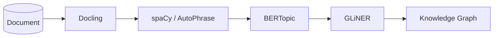

# Approach 1: spaCy/AutoPhrase + BERTopic + GLiNER

```mermaid
flowchart LR
    A[(Document)] --> B[Docling]
    B --> C[spaCy / AutoPhrase]
    C --> D[BERTopic]
    D --> E[GLiNER]
    E --> F[Knowledge Graph]
```