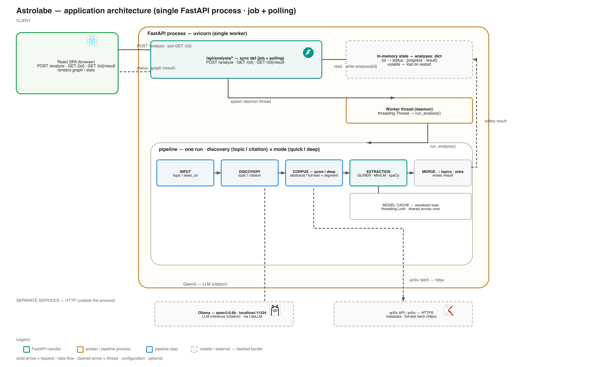

# Application architecture

This page shows the **in-process application architecture**: the single FastAPI
process, its volatile in-memory state, the job + polling request flow, and how
the pipeline is composed — local models vs. the separate HTTP services.

It complements the [deployment](deployment.md) page (target AWS topology) and
the [runtime & API](runtime.md) page (request lifecycle, dispatch, gaps).

## Single process, job + polling

The analysis API does **not** process inline: `POST /analyze` returns an id
immediately, a **daemon worker thread** runs the pipeline, and the client polls
`GET /{id}` until a final `GET /{id}/result` fetches the graph. All state lives
in a plain **in-memory dict** (`analyses[id]`) — `backend/src/kgraph/api/state.py` —
so it is **volatile**: lost on restart, invisible across uvicorn workers, and
wrong under `--workers > 1`.



> Editable source: `docs/assets/app_architecture.drawio` (open in
> [draw.io](https://draw.io) — the desktop app renders the embedded icon PNGs).
> Regenerable from `scripts/gen_app_drawio.mjs`, which emits **both** the
> `.drawio` **and** this PNG (SVG render + sharp), so the docs image never
> depends on the draw.io CLI:

> ```bash
> cd scripts && node gen_app_drawio.mjs && node verify_icons.mjs
> ```

## Components

| Component | Role |
|---|---|
| **React SPA** | Client; `POST /analyze`, polls `GET /{id}` every 1 s, renders `/result` |
| **FastAPI handlers** (`/api/analysis/*`) | Sync `def` endpoints; spawn the worker thread and return `AnalysisStatus` |
| **In-memory state** | `analyses: dict` — status, progress, result; lost on restart |
| **Worker thread** | `threading.Thread(target=run_analysis, daemon=True)` |
| **pipeline (one run)** | `INPUT (topic\|seed_url) → DISCOVERY (topic\|citation) → CORPUS (quick\|deep) → EXTRACTION → MERGE` |
| **Model cache** | Single-load lock (threading.Lock) around GLiNER / MiniLM / spaCy loads |
| **Ollama · qwen3:0.6b** *(dashed)* | Optional LLM inference for citation discovery, over HTTP `localhost:11434` |
| **arXiv API / ar5iv** *(dashed)* | Optional upstream fetch for metadata / full text, over HTTPS |

Two execution domains (see [runtime §2](runtime.md#2-pipeline-composition-at-runtime)):

- **In-process** — the local models run inside the uvicorn worker via
  torch / sentence-transformers; their (heavy) loads are serialized behind the
  model-cache lock.
- **Separate services (HTTP)** — Ollama for the LLM route and arXiv/ar5iv for
  document retrieval; both dashed because deployment of those is out of this
  process's scope (see [Deployment](deployment.md)).

## Why the dashed state / thread edges

The dashed border on **in-memory state** and on **Ollama / arXiv** marks
"volatile or external": the state is the main fragility of the current design —
it forces single-process operation and loses jobs on restart. The thread edges
(`spawn daemon thread`, `run_analysis()`) are dashed because they are
process-internal, not network request flows.

See [runtime §6](runtime.md#6-what-exists-vs-whats-missing) for the recommended
evolution (unique ids, bounded concurrency, durable state) if this becomes a
multi-user service.