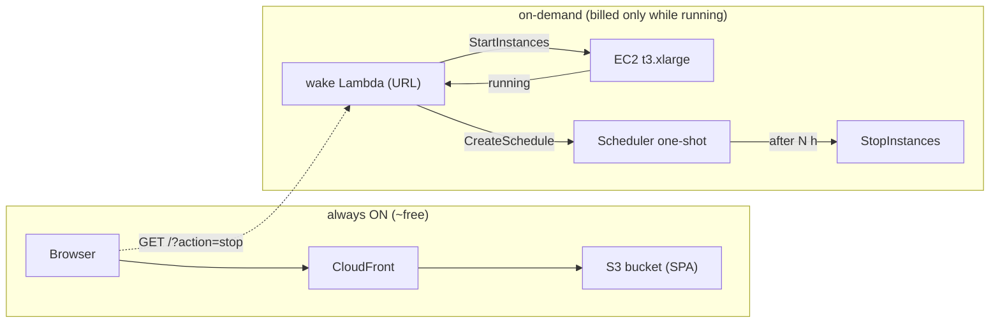

# AWS on-demand deployment (Terraform)

> **Status: designed + Terraform written, nothing applied yet.** The code lives in
> `infra/terraform/` on branch `ft/aws-deploy`. This page is a *learning walkthrough*:
> it explains the "on-demand" model, the AWS services the stack touches, the Terraform
> concepts behind the code, the operating commands, and the cost model — so that the
> `$200` of credits last as long as possible.

If you want the architectural *why* (single-instance stateful ML workload, Docker
Compose, sizing), read [Deployment](deployment.md) first. For the planned
CI/CD (ECR images, GitHub OIDC, SSM deploys) see [CI/CD & AWS bootstrap](pipelines.md).

## What "on-demand" means here

Astrolabe is a **single-instance, stateful ML workload** (models in RAM, in-memory
`analyses` dict). That does not click with autoscaling, but it *does* click with a
very cheap operating model:

- The **EC2 VM is stopped by default** and only spins up when you actually want to
  run an analysis.
- A tiny **Lambda function (public URL)** is the "wake button": it starts the VM,
  waits until the OS is `running`, and returns the new public IP.
- Before returning, it **arms an auto-stop**: an EventBridge Scheduler one-shot
  schedule will force-stop the VM after `auto_stop_seconds` (default 3 h) — the
  anti-forget guard.
- The **frontend (React SPA) is served from an S3 bucket through CloudFront**, so
  the website is always up even while the backend VM is asleep.



Compare with the "always-on VM" story in [deployment.md](deployment.md): the same
background, cheaper clock. Everything runs in the account's **single selected
Region, `eu-north-1`** (a fixed rule of the new AWS experience), except CloudFront,
which is a global service and is allowed.

## The `$200` as a compute-hour pool

Think of the credits as a **pool of EC2 running-hours**, because that is the only
line item that moves the needle. Approximate on-demand prices in eu-north-1:

| Instance | RAM | $/h | `$200` ≈ hours | Always on | On-demand use |
|---|---|---|---|---|---|
| `t3.xlarge` (default) | 16 GiB | ~0.168 | ~1,190 h | ~50 days | **months–years** |
| `t3.large` | 8 GiB | ~0.086 | ~2,300 h | ~96 days | months–years |
| `t3.large` **Spot** *(test only)* | 8 GiB | ~0.031 | ~6,500 h | ~9 months | years |

Two levers dominate:

1. **Right-size per scenario.** `t3.xlarge` is the default (GLiNER-large + Ollama fit
   comfortably); drop to `t3.large` only for quick, RAM-light runs. The Terraform
   exposes `instance_type` so you switch with one `apply`.
2. **Duty cycle.** A VM that is off 95% of the time costs ~5% of its always-on
   price. The wake/auto-stop mechanism exists purely to make that duty cycle
   automatic instead of a memory chore.

**On-demand vs Spot.** The wake pattern starts the VM *whenever you ask* — Spot can
say "not now" (very low capacity in the family/zone) or reclaim the instance with a
~2-minute warning mid-use. For human-initiated Astrolabe analysis that interruptibility
is unacceptable, so the default stack is on-demand. Spot is a good cheap option only
for scheduled, non-interactive test runs.

**Budget hygiene** (each is a small recurring cost that erodes the pool even at zero
usage — a useful mental model: an always-on t3.xlarge burns ~$4/day of the pool):

| Item | Cost while backend stopped |
|---|---|
| Elastic IP | ~`$3.6/mo` (an EIP is free only while it is attached to a *running* instance) |
| S3 + CloudFront (`PriceClass_100`) | cents/mo |
| wake Lambda (idle) | ~`$0` (untracked; you pay only per-invocation) |
| CloudWatch Logs | 7-day retention, negligible if the wake function is quiet |
| Route 53, ECR, EC2 itself | `$0` / no running VM |
| EBS root (30 GiB gp3) | ~`$2–3/mo` *only while the instance exists* (charged even stopped — the volume persists) |

So the "floor" spend with the VM parked is roughly **~`$6/mo`** (EIP + EBS), and
every analysis hour bills only the instance itself.

## The AWS services in this stack (concept → why → code)

Each block: what the service is, why the design needs it, and where it shows up in
`infra/terraform/`.

### EC2, AMI, user data, root volume, IMDSv2

- **EC2** = a virtual machine rented by the hour. Key States that matter here:
  `stopped` (not running, EBS persists), `pending` (booting after `start`),
  `running` (billing starts), `stopping`. The wake Lambda races `pending → running`
  and only considers the box "up" at `running`.
- **AMI** = the frozen disk template the instance boots from. We look up the latest
  Amazon Linux 2023 x86_64 via a Terraform **data source** (`data.aws_ami`), so the
  stack always uses the current, security-patched AMI instead of a hardcoded ID.
- **user_data** = a script the OS runs at first boot. Ours installs Docker +
  `docker compose`, enables the daemon, and creates `/opt/astrolabe`. Logged to
  `/var/log/astrolabe-userdata.log` for debuggability.
- **Root EBS volume**: `gp3`, 30 GiB, **encrypted**. The Astrolabe doc
  deliberately has *no data volume* (analyzes stream as ar5iv HTML; nothing is
  persisted), so the root disk just holds the OS + compose + images.
- **IMDSv2 (`http_tokens = "required"`)**: the instance's metadata service (where a
  short-lived IAM credential token lives) is addressed with a session token only —
  blocks the classic SSRF metadata-scrape attack.

`ec2.tf`: `aws_instance.backend`, `aws_ami.amazon_linux_2023`.

### Elastic IP

A static public IPv4 that survives stops. Two facts that out the cost model:

- While the instance **runs**, the EIP is free.
- While the instance is **stopped**, AWS bills ~`$0.005/h` (~`$3.6/mo`) per unmounted-or-stopped IPv4 — one of the small "floor" costs above.

`ec2.tf`: `aws_eip.backend`.

### Security groups & the default VPC

- **VPC** = the private network the instance lives in. We reuse the account's
  **default VPC** (`data.aws_vpc` / `data.aws_subnets`) — fine for a single demo box.
- **Security group** = a firewall at the network edge. The rule set is *explicit
  allow-list of what may come in*:
  - `80` from anywhere → HTTP demo (before TLS + domain exist).
  - `443` from anywhere → the future nginx TLS endpoint.
  - No `22` at all — deploys go through **SSM** (port 443 out) instead of SSH.
  - Egress defaults to all — fine here.

`ec2.tf`: `aws_security_group.backend`, `aws_vpc_security_group_ingress_rule.http/.https`.

### IAM — who may do what

The single mental model for everything that touches permissions:

- **Role** = a "carrier" with a *trust policy* (who may assume it) and *policies*
  (what it may then do). No passwords — the carrier is assumed.
- **Policy** = a JSON list of `Action` on `Resource` (+ optional `Condition`).
- **Instance profile** = how you attach a role to an EC2 instance so processes
  *inside* it can call AWS APIs.

In the stack:

| Role | Trust | Grants |
|---|---|---|
| `…-backend` (instance profile) | `ec2.amazonaws.com` | `AmazonSSMManagedInstanceCore` → SSM can administer the box, no SSH |
| `…-wake` (Lambda) | `lambda.amazonaws.com` | start/stop/describe EC2, create/delete the one-shot schedule, `PassRole` the scheduler role, write logs |
| `…-wake-scheduler` | `scheduler.amazonaws.com` | `lambda:InvokeFunction` on the wake function (so the auto-stop can fire) |

`iam.tf`: `aws_iam_role.*`, `aws_iam_policy.*`, `aws_iam_instance_profile.backend`.

### Lambda + Function URL — the wake button

- **Lambda** = serverless function: you upload code, AWS runs it on demand, you pay
  per invocation & runtime (an idle function costs nothing).
- **Function URL** = a plain HTTPS endpoint on the Lambda without needing API
  Gateway.

The wake function (`lambda/start_instance.py`) is a single file, ~120 lines, no
dependencies beyond the bundled `boto3`. Given the chosen endpoint it:

1. Requests `StartInstances` (idempotent).
2. Polls `DescribeInstances` until State == `running` (**up to `STATE_TIMEOUT`, 300 s**;
   the Lambda timeout is set to 420 s to cover the poll loop).
3. Arms the auto-stop schedule (below).
4. Returns `{"status":"running","public_ip":…}` — the IP is the answer a browser
   needs to touch the backend.

`GET /?action=stop` → `StopInstances` + cancel the pending schedule.

> **Security caveat (read this):** `authorization_type = "NONE"` means *anyone who
> knows the URL* can start/stop your instance. For a demo this is acceptable,
> because the blast radius is bounded (`auto_stop_seconds` of t3 + the EIP floor).
> Later: front it with CloudFront + a secret header, or swap to API Gateway with a
> key.

`lambda.tf`: `aws_lambda_function.wake`, `aws_lambda_function_url.wake`.

### EventBridge Scheduler — the anti-forget guard

A serverless meeting-grid planner: "do X at time Y". We use a **one-shot** schedule:

```python
SCHEDULER_CLIENT.create_schedule(
    Name="kgraph-astrolabe-auto-stop",
    ScheduleExpression=f"at({at.strftime('%Y-%m-%dT%H:%M:%S')})",   # UTC
    FlexibleTimeWindow={"Mode": "FLEXIBLE", "MaximumWindowInMinutes": 5},
    ActionAfterCompletion="DELETE",        # the schedule eats itself after firing
    State="ENABLED",
    Target={"Arn": WAKE_LAMBDA_ARN, "RoleArn": SCHEDULER_ROLE,
            "Input": json.dumps({"action": "stop", "via": "auto-stop"})},
)
```

- The **Target** is the wake Lambda itself, invoked with `{"action":"stop"}` — so
  the same function handles both the human stop and the automatic one.
- **`ActionAfterCompletion="DELETE"`** makes the one-shot remove itself after
  firing, so schedules never accumulate.
- Every new `start` first deletes any pending stop-schedule, then creates a fresh
  one (next-armed-wins).
- Why the Lambda needs **two** IAM roles here: it can't `CreateSchedule` *targeting*
  a role it can't pass (`iam:PassRole`), and the scheduler can't fire Lambda it can't
  invoke (`lambda:InvokeFunction`). That pairing is the classic automation pattern.

### S3 + CloudFront + OAC — the always-on website

- **S3** = object storage. Holds the built React app (`dist/`) for pennies and is
  **private** (`block_public_acls`, etc. — no direct public access).
- **CloudFront** = global CDN with HTTPS. It is the public face, and it fetches the
  private bucket through **OAC** (Origin Access Control — a sigv4-signed handshake
  authorized by the S3 **bucket policy** scoped to the distribution's ARN:
  `Principal: cloudfront.amazonaws.com`, `Condition: AWS:SourceArn`).
- SPA routing: unknown paths (e.g. `/settings`) would 404 in S3, so CloudFront
  `custom_error_response` maps 403/404 → `200 /index.html`.
- `PriceClass_100` = only cheapest PoPs (Europe/North America) — plenty for this
  audience, and the cheapest data-transfer class.

In short, `s3.tf` holds the bucket + OAC + distribution + bucket policy.

## Terraform, from zero (the learning run-through)

Everything below is what the three words "terraform plan / apply" actually mean.

**Declarative infrastructure.** You describe the *end state* (an instance exists,
a security group allows 80/443, …). Terraform figures out the diff to get there.
This is the opposite of imperative scripts (`aws ec2 run-instances …`).

**Provider.** `hashicorp/aws` translates Terraform's generic resource schemas
(`aws_instance`, `aws_lambda_function`…) into AWS API calls — and knows the current
API shapes. Version-pinned in `main.tf` (`>= 5.0`) and locked in
`.terraform.lock.hcl` for reproducible installs.

**Resources vs data sources.** A **resource** (`resource "aws_x" "name"`) *creates
and owns* a thing. A **data source** (`data "aws_x" "name"`) only *reads something
that already exists* — our `aws_ami` lookup, `aws_vpc`/`aws_subnets` (default VPC),
and `aws_caller_identity` (your account number) are all reads, not creations.

**Variables / locals / outputs.**

```hcl
variable "instance_type"   { default = "t3.xlarge" }  # user knob (tfvars)
local.wake_function_name                               # computed, reused
output "wake_url" { … }                                # printed after apply; curl $(terraform output -raw wake_url)
```

**State.** Terraform stores what it *thinks* exists in `terraform.tfstate` (gitignored).
`plan` compares real AWS against state; `apply` writes the new reality back into it.
If state is lost you lose Terraform's memory of ownership (resources were otherwise
left running and billing — danger!). A remote S3 backend is the fix for teams (see [pipelines.md](pipelines.md)).

**plan is dry-run, apply is money.** `terraform plan` hits read-only AWS APIs, costs
nothing, and prints the exact diff ("24 to add"). `apply` executes it and provisioning
starts billing (EIP the moment it exists, the EBS volume, etc.). The repository rule
of thumb: *plan as often as you like, apply only when you mean it.*

**Dependencies and the one real bug we hit.** Terraform builds a graph: `apply`
orders resources so a thing is created before its dependents reference it. During
development the plan failed with a self-referential block — you *cannot* refer to a
resource inside its own definition. The wake Lambda's `environment` needed its own
ARN, which is a fixed function of name/region/account — so we compute it once in a
`local` instead of self-referencing:

```hcl
locals {
  wake_function_name = "${var.project}-wake"
  wake_function_arn = "arn:aws:lambda:${var.region}:${data.aws_caller_identity.current.account_id}:function:${local.wake_function_name}"
}
```

**The workflow, commands:**

```sh
cd infra/terraform
cp terraform.tfvars.example terraform.tfvars   # one unique S3 bucket name is mandatory
terraform init          # downloads providers, creates .terraform.lock.hcl
terraform fmt           # canonical formatting (always after editing)
terraform validate      # syntax + schema check (offline)
terraform plan          # network, read-only: shows the diff against your account
terraform apply         # the only step that provisions (and starts billing)
```

## Operating the stack

After `apply`:

```sh
cd infra/terraform
terraform output                   # all values, incl. the HTTP/HTTPS URLs
terraform output -raw wake_url     # exactly the endpoint for scripting

curl "$(terraform output -raw wake_url)"            # START: wakes the VM + arms 3h auto-stop
curl "$(terraform output -raw wake_url)?action=stop" # stop manually now
```

Expected wake response, if all is well:

```json
{"status": "running", "instance": "i-…", "public_ip": "13.xx.xx.xx"}
```

If it returns `"status": "starting"` (the 300 s window was too short), just call it
again a minute later — the stack is idempotent. To watch the machinery:

- Watch the instance with `aws ec2 describe-instance-status` or the EC2 console.
- The auto-stop schedule is visible in **EventBridge → Schedules** (`…-auto-stop`).
- The Lambda's stdout/stderr land in **CloudWatch → Log groups** ⇒
  `/aws/lambda/kgraph-astrolabe-wake` (7-day retention).

Switching instance size for a light run: edit `terraform.tfvars`
(`instance_type = "t3.large"`) then `apply` (instance is replaced; EIP is carried).
The default stays `t3.xlarge`.

## Worked cost scenarios on the `$200`

| Scenario | Result |
|---|---|
| t3.xlarge always on | ~50 days |
| t3.large always on | ~96 days, then empty |
| on-demand demo: 1 h/day (`t3.xlarge`) | $200 ÷ (0.168 · 1h + ~0.2/mo floor) ≈ years |
| one 3 h `deep` run every few days | effectively unbounded within the period |

The takeaway: this pattern turns a "2-day cloud" into a "months/years cloud" purely
by never paying for an idle VM. The credits' renewal habit (12 h credentials, 90 d
refresh) lives in the AWS CLI setup — the docs here care only about spend.

## Security notes (summary)

- **wake function URL is public** (`auth NONE`) — bounded blast radius, upgrade path
  documented above.
- **No SSH anywhere** — SSM only; the instance IAM profile has
  `AmazonSSMManagedInstanceCore`.
- **IMDSv2 required** on the instance.
- **S3 bucket is fully private**; CloudFront OAC is the only reader; SPA fallback
  maps 403/404 → `/index.html`.
- **IAM least-privilege**: each role carries only the actions it needs (a policy
  triple you can read top to bottom in `iam.tf`).

## Current status & next steps

- **Status:** account exists (new AWS experience, `eu-north-1`, profile `default`).
  Terraform stack written and `plan`-validated (24 resources) on `ft/aws-deploy`;
  **not applied** — nothing is billed yet.
- **Next:** `apply`, upload the built SPA to the S3 bucket, then ECR images + an
  SSM-based `docker compose up` on the box (see [pipelines.md](pipelines.md)),
  custom domain + ACM + Route 53 when owned, and a remote tfstate bucket when the
  team grows.