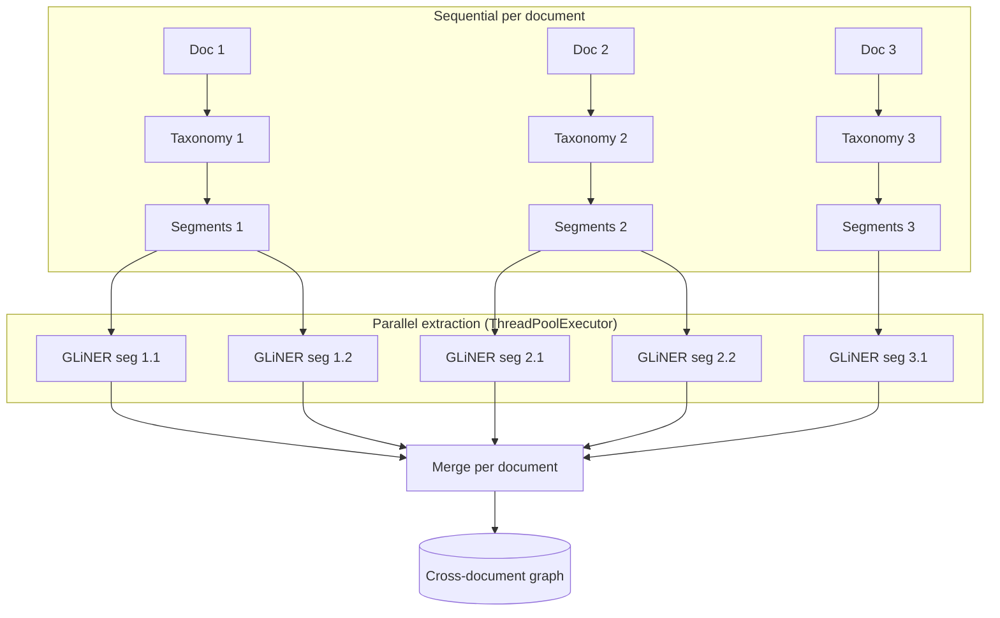

# Corpus & multi-document — stage 6

`corpus-demo` (`kgraph/corpus/merge.py`) scales the assembly pipeline to a **folder of documents** and turns them into a cross-document graph.

## Execution model

The pipeline processes documents in two phases: a **sequential per-document phase** (taxonomy + segmentation) followed by a **parallel cross-document phase** (extraction over all segments).



### 1. Taxonomy (sequential, per document)

Discovery (stages 1–3) runs **independently on each document** in a sequential loop. Each document gets its own entity/relation labels via `TopicGraph.build()`. This is sequential because:

- Each `TopicGraph` instance accumulates state (nodes/edges), so reuse across documents would contaminate later taxonomies.
- KeyBERT and spaCy models are shared but not thread-safe for concurrent document processing.

### 2. Segmentation (sequential, per document)

`Segmenter.segment()` splits each document into token-bounded, section-aware segments. This runs in a sequential loop building a flat list of `(document, segment)` pairs.

### 3. Extraction (parallel, across all segments)

All segments from all documents are submitted to a `ThreadPoolExecutor`. Each segment is processed independently:

- `extract_entities_relations()` runs GLiNER inference on the segment text.
- The segment's `doc_id` tracks which document it belongs to.
- Results are accumulated per document via `_accumulate()`.

The number of workers defaults to half the CPU count (`segmentation.workers = 0`).

!!! note
    **Why parallel by segment, not by document?** GLiNER inference releases the GIL during torch computation, so threads give real parallelism on CPU. Document-level parallelism would require process-based parallelism (heavier) or GPU scheduling (not available on CPU).

### 4. Merge & summarize (sequential)

`_merge_per_document()` folds per-document results into a single `networkx.MultiDiGraph`, and `summarize_corpus()` computes common/unique counts.

## CLI usage

```sh
uv run corpus-demo --workers 4 --max-pages 10   # local PDF folder, 4 workers, drop long papers
uv run corpus-demo --fetch 5 --arxiv-query '"LLM agents"'  # download arXiv PDFs first
```

The interactive HTML (`--output-html`) renders common nodes/edges in green and document-unique ones in each document's palette color, with a summary/novelty panel and a per-document filter; nodes without edges are not drawn:


## Known limitations

- **Taxonomy and segmentation are sequential** — scaling to hundreds of documents would benefit from process-based parallelism (not yet implemented).
- Each `build()` call must start from a fresh `TopicGraph` per document — `TopicGraph.build` accumulates into `self.graph`, so reusing one instance across documents contaminates later taxonomies (`CorpusGraphBuilder` builds a fresh one per document).
- Cross-document **entity matching is lexical** (canonical/containment merging): the same concept phrased differently across papers still counts as two unique nodes, which inflates the novelty view.
