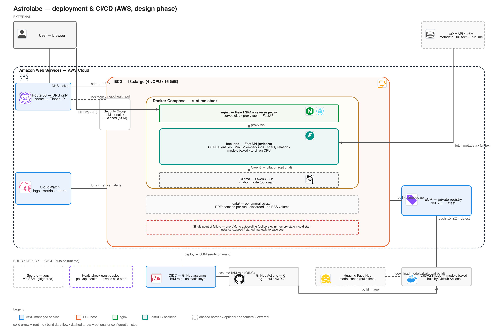

# Deployment (design phase)

> **Status: design → provisioning.** This page records the *agreed* target
> architecture for hosting Astrolabe on AWS. An account already exists (new AWS
> experience, selected Region `eu-north-1`) and the first Terraform slice —
> EC2 + wake Lambda + auto-stop scheduler + static site on S3/CloudFront — is
> written on branch `ft/aws-deploy` (`infra/terraform/`), **validated but not
> applied** (nothing billed yet). For the "on-demand" operating model (VM asleep
> by default, woken on demand, auto-stop guard) plus the Terraform walkthrough,
> see [AWS on-demand deployment](aws-ondemand.md).

## Target architecture

The application is a **single-instance, stateful ML workload**, not a stateless web tier:

- The **backend** (FastAPI at `backend/src/kgraph/api/main.py`) loads heavy local models into memory per process — GLiNER, SentenceTransformer/MiniLM, spaCy (`backend/configs/params.yaml`), all PyTorch-backed.
- Analysis runs in **background threads** and its state lives in an **in-process dict** (`backend/src/kgraph/api/state.py`) — no database, no shared state.
- The optional **citation mode** shells out to **Ollama** (`ollama/qwen3:0.6b`) for the concept taxonomy.

`quick` mode (abstracts only) is light; `deep`/citation work drives real CPU + RAM usage. Because of the in-memory state and large model cold-start, the design is one always-on VM with Docker Compose — horizontal autoscaling (and therefore serverless/Fargate-first) is deliberately out of scope for now.



> **Two diagrams cover the architecture:** this one shows the **infra / CI-CD**
> topology ([`deploy.drawio`](../assets/deploy.drawio)); the
> [application architecture](app-architecture.md) page shows the **single
> FastAPI process** behind it (state, worker thread, pipeline, model cache).
> Keep both in sync when you change either.

> Editable source: `docs/assets/deploy.drawio` (open in [draw.io](https://draw.io) — the desktop app renders the embedded icon PNGs). Regenerable from `scripts/gen_deploy_drawio.mjs`, which emits **both** the `.drawio` **and** this PNG (SVG render + sharp), so the docs image never depends on the draw.io CLI (its headless exporter ignores embedded images):
>
> ```bash
> cd scripts && npm install && node gen_deploy_drawio.mjs
> node gen_app_drawio.mjs    # companion app-architecture diagram
> node verify_icons.mjs       # sanity-checks icons in BOTH diagrams paint
> ```

## Components

| Component | Role | Notes |
|---|---|---|
| **User — browser** | Client | HTTPS; the React SPA itself runs **in the cloud**, served by nginx |
| **Route 53** | DNS only | Resolves the app name → EC2 Elastic IP; no ALB — TLS terminates at nginx |
| **EC2 `t3.xlarge`** | Compute host | 4 vCPU / 16 GiB — runs Docker Compose |
| **Security group** | Inbound policy | `443` allowed → nginx; `22` restricted (deploys go through SSM, not SSH) |
| **nginx container** | Frontend + reverse proxy | Serves `dist/` (React SPA), proxies `/api` → FastAPI; TLS termination |
| **FastAPI container** | Graph pipeline | `uvicorn kgraph.api.main:app` on `:8000` |
| **Ollama container** *(optional)* | Qwen3 0.6b | Only needed for citation-guided discovery |
| **Ephemeral storage** | Runtime scratch | `data/` **is barely touched**: full text streams as ar5iv HTML (BeautifulSoup) — the only PDF download is the seed paper in quick mode; all discarded. **No persistent user data, no EBS volume** |
| **Hugging Face Hub** | Model cache | Downloaded at image build time (offline at runtime), via GitHub Actions → Docker image |
| **arXiv / ar5iv** | Upstream sources | Fetched over the internet at runtime |
| **ECR** 🏷 (diagram) | Private image registry | `kgraph/backend` + `kgraph/frontend`, tagged `:vX.Y.Z` (+ `:latest`); pushed from CI, pulled on the EC2 |
| **OIDC / IAM role** 🔑 (diagram) | CI auth | GitHub assumes a Terraform-created IAM role (no static credentials) to push to ECR and run SSM deploys — see [pipelines](pipelines.md) |
| **CloudWatch** 📈 (diagram) | Observability | Logs + basic metrics + alerts from the one instance |
| **Healthcheck** (post-deploy) | Deploy verification | Poll `/api/health` (via Route 53) after `compose up` to wait out the model cold-start |
| **Secrets — `.env`** (diagram) | Config | `.env` lives **on the box via SSM** (gitignored); only `.env.example` is committed |

> The diagram marks the instance as a **single point of failure** (deliberate):
> one VM, no autoscaling — justified by the in-memory state + cold-start model
> (see below). To save cost it is kept **asleep unless used**: the on-demand
> wake/auto-stop stack automates that (see [AWS on-demand deployment](aws-ondemand.md)),
> versus the old ~$75/mo always-on `t3.xlarge`.

## Chosen approach: EC2 + Docker Compose

**Why this over a managed/serverless option:**

1. **In-memory state** (`analyses` dict, background threads) means the app is not horizontally scalable today. A single VM matches the actual concurrency model.
2. **Heavy cold-start**: models are GBs of PyTorch weights loaded once per process — the long-lived VM amortizes this.
3. **Shared runtime state across containers** (Ollama on `localhost:11434`, `data/` writes) is trivial with Compose.
4. **Cheapest correct** option: one `t3.xlarge` is ~$75/mo; everything serverless-oriented would cost more for the same single-user or small-team workload.

**Sizing plan:**

| Workload | Instance | Notes |
|---|---|---|
| Development / demo | `t3.large` (2 vCPU, 8 GiB) | OK for `quick` mode, abstracts only |
| **Recommended** | **`t3.xlarge`** (4 vCPU, 16 GiB) | Handles `deep` + citation; headroom for GLiNER/MiniLM/Ollama in RAM |
| Heavy / GPU experiments | `g4dn.xlarge` | Only if torch demanded GPU — not required by the current pipeline |

## Alternatives (documented, not chosen)

| Option | Fit | Why not default |
|---|---|---|
| **Lightsail container** | Single-click VM+container | Same model as EC2+Compose, less control; fine later for demo |
| **ECS Fargate** | Managed containers | Cold starts + no in-memory multi-instance + EFS for models; value only *after* decoupling |
| **App Runner** | Simple single container | No GPU/RAM flexibility; poor fit for long-running ML requests |
| **Lambda** | Serverless | Hard limits on time/memory; background threads + GB models impossible |

## Open decisions

- **Storage (not persisted)**: models are **baked into the image** and PDFs are **ephemeral** — `data/` is fetched per analysis and discarded, so there is **no EBS data volume**; only the root disk persists (compose + `.env`). Keeps the instance nearly disposable.
- **Ollama placement**: sidecar container vs. host service. Container keeps Compose self-contained; host keeps model cache separate.
- **TLS termination**: nginx directly (fewer moving parts) vs. an ALB in front (needed only once HTTPS/cert rotation or multiple instances appear).
- **State**: in-memory today; if concurrent users appear, move `analyses` to Redis and pipeline runs to workers — that is the moment Fargate/EKS starts paying off.
- **Observability**: CloudWatch agent for logs/metrics; cheap and enough for one instance.

## First-class concerns before deployment

- `backend/configs/params.yaml` uses **relative model paths** (`models/...`) — the image must reproduce that layout (`WORKDIR` + `models/` inside the image), not expect an external mount.
- `HF_HUB_OFFLINE=1` and docling cache location (`models/hub/`) must be replicated **inside the image** (see [parsers](../architecture/ingestion.md)).
- **Ephemeral `data/`**: `quick`/citation modes never touch PDFs — full text comes as **ar5iv HTML** parsed with BeautifulSoup (`runner._fetch_arxiv_html`); the only PDF is the seed paper in quick mode (reference extraction). Everything is discarded per run, so there is no cache to maintain.
- CORS in `main.py` allows `http://localhost:5173` only — relax when frontend is served from the same origin via nginx.