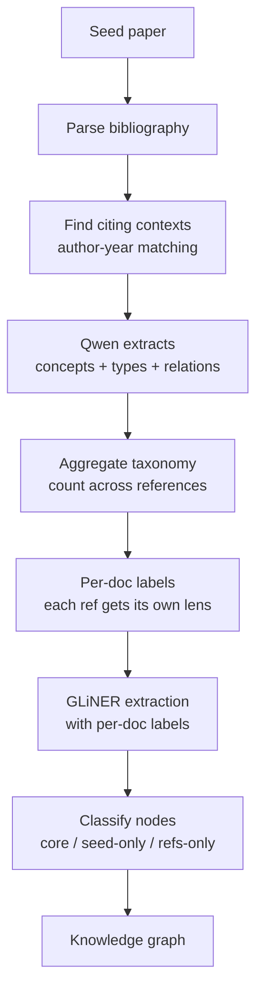

# Discovery — stages 1–3 (LLM-free)

Discovery grows the *topic graph* from the document: the seeds and relations that later become GLiNER's label taxonomy. It is deliberately **LLM-free and deterministic** — a small local model hallucinated evidence and generic relations during early exploration, so it was dropped from discovery.

**The key idea: KeyBERT provides the seeds, and from those seeds the pipeline discovers both the relations and the new topics — iteratively and without an LLM.**

The design is a synthesis of two extremes that were both unsatisfactory on their own:

- **KeyBERT alone falls short** — it returns a handful of phrases and no relationships between them.
- **Extracting every subject-verb-object triple** (the naive spaCy approach) is too much — every sentence of the document produces edges, drowning the signal in noise.

The compromise is a **topic-guided expansion**: only the relations whose endpoints touch a *known* topic are kept, and each new endpoint becomes a topic that can be expanded in turn, up to a configured depth.

## Stage 1 — Adaptive KeyBERT (seeds)

`AdaptiveKeyBERT` (in `kgraph/extractors/key_bert.py`) replaces a fixed `top_n` with an **adaptive count** driven by two signals: document length and the shape of the similarity scores.

### The adaptive count algorithm

1. **Generous pool.** Ask KeyBERT for a wide pool of candidates (`use_maxsum=True` for diversity), scaled to document length:

   ```python
   est = round(n_words / words_per_kw)              # length signal
   pool = max(max_k, min(max_candidates, est))
   ```

2. **Noise floor.** Drop anything below `score_floor`.

3. **Elbow cutoff.** Look for the *knee* of the sorted similarity scores inside the `[min_k, max_k]` window, using the `kneed` library:

   ```python
   window = scores[min_k - 1 : min(max_k, len(scores))]
   knee = KneeLocator(x, window, curve="convex", direction="decreasing").knee
   cutoff = max(min_k, min(max_k, knee))
   ```

   The idea: KeyBERT's scores normally drop sharply at the point where "this describes the text" becomes "this is filler".

### Configuration

Under `keyword_extractor.adaptive` in `backend/configs/params.yaml`:

| Key | Default | Meaning |
| --- | --- | --- |
| `min_k` | 2 | Minimum keywords to keep |
| `max_k` | 20 | Upper bound of the elbow search window |
| `words_per_kw` | 40 | Length scaling: ~1 keyword per N words |
| `score_floor` | 0.2 | Relevance threshold below which candidates are dropped |
| `max_candidates` | 25 | Cap on the generous pool requested from KeyBERT |

## Stage 2 — Relation extraction (spaCy dependencies, no LLM)

`DependencyRelationExtractor` (in `kgraph/discovery/dependency_relations.py`) extracts relations from the dependency tree. For each sentence it takes the predicate verbs — the root verb plus verb complements/conjuncts (`xcomp`, `ccomp`, `conj`) — and derives the arguments from each verb:

```python
for sent in nlp(doc).sents:
    root = sent.root
    for verb in _verbs(root):        # root + xcomp / ccomp / conj
        subj = _subject(verb, root)  # nsubj / nsubjpass
        obj  = _object(verb)         # dobj, or pobj of a preposition
        label = f"{verb.lemma_} {prep}"   # "obtained from", "reported to"
```

Key rules:

- **Relation labels are auto-discovered.** The label is the verb lemma plus its preposition ("obtained from", "reported to", "charging"). There is no ontology — it emerges from the parse.
- **Pronoun subjects are dropped as nodes.** When the subject is a pronoun ("I obtained..."), the relation is re-anchored between the direct object and the prepositional object: *"I obtained a mortgage loan from Meridian Home Lending"* → `mortgage loan --obtained from--> Meridian Home Lending`.
- **Prepositions attached to nouns are also followed** (*"reported the missed payments **to Equifax**"*, where `to` hangs off `payments`).
- The **evidence** is always the sentence the relation was parsed from — it cannot be hallucinated because nothing generates it.

### A worked example

Sentences in, relations out:

```text
"I obtained a mortgage loan from Meridian Home Lending in June 2021."
  → mortgage loan --obtain from--> Meridian Home Lending
  → mortgage loan --obtain in--> June

"The servicing of my loan was transferred to Summit Loan Servicing."
  → servicing --transfer to--> Summit Loan Servicing

"Summit Loan Servicing reported the missed payments to Equifax."
  → Summit Loan Servicing --report--> missed payments
  → Summit Loan Servicing --report to--> Equifax        # 'to' hangs off the noun

"Summit Loan Servicing began charging me a late fee of $75."
  → Summit Loan Servicing --charge--> late fee          # 'charging' is xcomp of 'began'
```

Note what the rules do on the first example: the subject `I` is a pronoun, so the relation is re-anchored between the object `mortgage loan` and the prepositional object `Meridian Home Lending`, and the label becomes the verb lemma plus its preposition (`obtain from`).

## Stage 3 — Topic-guided expansion (BFS)

`TopicGraph` (in `kgraph/discovery/topic_graph.py`) grows the graph from the seeds:

```python
queue = deque(seeds)                    # depth 0
while queue:
    topic = queue.popleft()
    if depth(topic) >= max_depth:
        continue
    for rel in relations:
        if not (touches(rel.source, topic) or touches(rel.target, topic)):
            continue                    # relation not related to a known topic
        add_edge(rel)
        for endpoint in (rel.source, rel.target):
            if endpoint != topic and endpoint not in graph:
                add_node(endpoint, depth + 1)
                queue.append(endpoint)  # new topic to expand
```

- **`touches`** is a token overlap between the endpoint and the topic (e.g. the seed `payments equifax` pulls in `missed payments` because they share `payments`).
- Every endpoint that is not the topic itself and not yet in the graph becomes a **new node at `depth + 1`** and is queued for expansion — this is how new topics keep appearing from the seeds.
- Duplicate edges and the seed phrases themselves (which may not appear verbatim in the text) are handled: edges are deduplicated by `(source, target, relation)`.

### A worked example

Seeds are enqueued at depth 0 and expanded breadth-first. Each expansion pulls every relation touching the topic, and the *other* endpoint becomes a new node:

```text
depth 0  payments equifax  ·  late fee
         │
         ├─ report ─────────────►  missed payments   (shares "payments")
         ├─ report to ──────────►  Equifax           (shares "equifax")
         └─ charging ──────────►  late fee           (a seed itself)

depth 1  Summit Loan Servicing  ·  missed payments  ·  Equifax
         │
         ├─ transfer to ────────►  servicing
         ├─ respond to ────────►  my dispute
         ├─ obtain from ───────►  Meridian Home Lending   (via shared "loan")
         └─ receive from ──────►  foreclosure notice
```

The expansion stops because the nodes it reaches are at `max_depth = 2`; the graph is seeded, not exhaustive.

### Configuration

Under `discovery` in `backend/configs/params.yaml`:

| Key | Default | Meaning |
| --- | --- | --- |
| `spacy_model` | `models/en_core_web_sm` | Local spaCy model; swap for another language (e.g. `models/es_core_news_sm`) |
| `determiners` | `[]` | Extra leading determiners stripped from spans, added to the English defaults (`the`, `a`, `an`) |
| `max_depth` | 2 | Maximum hops from the seeds (how far the expansion may grow) |
| `max_relations` | 100 | Hard cap on the number of graph edges |
| `skip_headings` | `references, bibliography, acknowledgements, acknowledgments` | Section headings excluded from discovery (boilerplate) |
| `max_seeds` | 25 | Cap on the unioned per-section seed pool handed to the expansion |

> Discovery runs **per document section** (docling heading paths when available, markdown headings otherwise), and the seeds/relations are unioned into one consistent label set — so the taxonomy keeps the whole document's vocabulary instead of abstract-level boilerplate. Boilerplate sections are skipped via `discovery.skip_headings` and the seed pool is capped by `discovery.max_seeds`.

### Demo output (CoT RL case)

Seeds `commonsense reasoning` and `model reason` expand into a 16-node graph (2 seeds at depth 0, 12 nodes at depth 1, 2 at depth 2) with 9 unique relations, e.g.:

```text
model          --exploit--> formatting artifacts
CoT RL model   --discover in--> principle
CoT-trained model --learn--> decomposition
CoT RL         --extend--> this idea
```

### Demo output (medium case)

`data/case_2/medium.txt` is the current default corpus. Seeds `described dumping` and `graphify credible` expand into a 7-node graph (2 at depth 0, 4 at depth 1, 1 at depth 2) with 3 unique relations:

```text
(d1) Karpathy --[describe]--> (d1) dumping papers
(d1) Karpathy --[articulate]--> (d2) shift
(d1) developer --[release]--> (d1) Graphify
```

## Continue reading

The discovered taxonomy is handed to GLiNER in [Assembly](assembly.md).

---

# Citation-guided discovery (alternative)

While the topic-guided approach discovers the taxonomy from the document itself, citation-guided discovery uses **the seed paper's own citations** to define what concepts matter in the state of the art. This is the approach validated in [Experiment 04](../experiments/index.md).

**The key idea: the seed's citations define the lens — Qwen reads each citing context to produce concepts/relations, which become the GLiNER taxonomy.**

## When to use which

| | Topic-guided | Citation-guided |
| --- | --- | --- |
| **Input** | Single document | Seed + its references |
| **Taxonomy source** | KeyBERT seeds + spaCy deps | Qwen reading citing contexts |
| **Needs LLM** | No (deterministic) | Yes (Ollama/Qwen) |
| **Classification** | No | core / seed-only / refs-only |
| **Entity types** | From spaCy/GiNER labels | From Qwen semantic types |
| **Best for** | Exploring one paper | Mapping seed vs. state of the art |

## How it works



### Step 1 — Parse bibliography

`parse_bibliography_entries()` (in `kgraph/discovery/bibliography.py`) parses the seed's References section into structured entries with arXiv IDs, author surnames, and publication years. Supports both bullet-style (docling) and numbered formats.

### Step 2 — Find citing contexts

For each resolved reference, the engine finds sentences in the seed body that cite it using author–year matching (e.g., "Baumel et al., 2018"). These citing contexts represent *what the seed highlights about that reference*.

### Step 3 — Qwen extraction

Each citing context is sent to Qwen (via Ollama/LiteLLM) with a structured JSON schema:

```python
class RefInsights(BaseModel):
    concepts: list[str]   # ["query focused summarization", "graph-based"]
    types: list[str]      # ["summarization", "graph structure"]
    relations: list[str]  # ["extends", "outperforms"]
```

The `types` field captures the semantic type of each concept — this information is preserved in the final graph.

### Step 4 — Aggregate taxonomy

Concepts and relations are counted across references. **A label suggested by more references is more central to the state of the art.** The top-K of each become GLiNER's zero-shot labels. Stop words are filtered using the configurable `get_stopwords()` utility.

### Step 5 — Per-document labels

Each reference gets its own GLiNER labels based on what the seed says about it. The seed gets the union of all labels. This produces a sharper extraction than a single global taxonomy.

### Step 6 — Classification

Every extracted entity is classified by where it survived:

| Class | Meaning |
| --- | --- |
| **core** | In the seed AND at least 2 references — shared state of the art |
| **seed-only** | Claimed/used by the seed alone — its novelty surface |
| **refs-only** | Background concepts the seed doesn't lean on |

## Configuration

Under `citation` in `backend/configs/params.yaml`:

| Key | Default | Meaning |
| --- | --- | --- |
| `ollama_model` | `ollama/qwen3:0.6b` | Ollama model for concept extraction |
| `ollama_api_base` | `http://localhost:11434` | Ollama API endpoint |
| `keep_alive` | `1m` | How long to keep the model loaded after last request |
| `max_refs` | 15 | Maximum references to resolve and analyze |
| `top_concepts` | 15 | Number of entity labels in the taxonomy |
| `top_relations` | 8 | Number of relation labels in the taxonomy |
| `max_chars` | 24000 | Full-text truncation per document |
| `stopwords_source` | `spacy` | Stop word source: `"spacy"` or `"config"` |
| `stopwords` | `[]` | Extra stop words (used when `stopwords_source="config"`) |

## CLI

```bash
uv run citation-demo --seed 2404.16130
uv run citation-demo --seed 2404.16130 --output output/citation_kg.json
uv run citation-demo --seed 2404.16130 --max-refs 10 --no-segmentation
```

## Module map

| Module | Role |
| --- | --- |
| `kgraph/discovery/bibliography.py` | Parse bibliography, extract arXiv/DOI IDs, author–year |
| `kgraph/discovery/citation_graph.py` | Core discovery engine (Qwen + aggregation) |
| `kgraph/discovery/citation_assembly.py` | Orchestrator: discovery → GLiNER → classification |
| `kgraph/utils/stopwords.py` | Configurable stop word loader (spaCy-first) |
| `kgraph/cli/citation_demo.py` | CLI entry point |

### Improved version — ar5iv full text + parallel refs (API pipeline)

The API's citation pipeline (`api/runner.py::_run_citation_pipeline`) is an improved, faster version of the same flow, used when the frontend runs citation-guided discovery:

1. **Seed full text from ar5iv HTML** (`_fetch_arxiv_html`) — no PDF download, no docling. The seed needs its full text for the bibliography step.
2. **Bibliography parsed from the ar5iv `section#bib` list** — items are `<li class="ltx_bibitem">` prefixed with `- ` for the existing parser.
3. **References resolved in parallel** with a `ThreadPoolExecutor` (up to 8 workers), each fetching full text via ar5iv in **deep** mode or just the abstract in **quick** mode:

   | Mode | Seed | References |
   | --- | --- | --- |
   | `quick` | full text (ar5iv) — needs it for the bibliography | abstracts only |
   | `deep` | full text (ar5iv) | full text (ar5iv), parallel |

4. The rest is unchanged: `CitationAssembly.run(seed_doc, ref_docs, bibliography=..., segmented=(mode == "deep"))` → Qwen taxonomy → per-doc GLiNER → classification.

Because GLiNER is loaded **once** from a process-wide cache (`extractors/model_cache.py`) and shared across every document/segment, successive analyses skip the ~6 s reload.

> The **parallelism here is per reference**: each `ThreadPoolExecutor` task resolves one reference's text, so refs are fetched concurrently regardless of mode. The GLiNER extraction (deep mode) is separately parallelized *per segment* — see [Segmentation](segmentation.md).
