# Architecture

The pipeline builds a knowledge graph from a corpus of research documents. It is a **citation-guided GLiNER assembly**: the seed paper's own references define what matters in the state of the art, a small local model (Qwen3) turns each citing context into a concept/relation taxonomy, and GLiNER extracts the final graph using exactly those labels — no hand-written labels.

## The pipeline at a glance

```mermaid
flowchart LR
    subgraph ING["Ingestion"]
        A[(Seed paper + references)] --> B["ar5iv HTML · docling · local files"]
        B --> C[(full text per document)]
    end
    subgraph DIS["Discovery (Qwen3 via Ollama)"]
        C --> D[Parse bibliography]
        D --> E[Find citing contexts<br/>author-year matching]
        E --> F[Qwen extracts<br/>concepts + types + relations]
        F --> G[Aggregate taxonomy<br/>count across references]
        G --> T[Taxonomy: entities + relations]
    end
    subgraph SEG["Segmentation"]
        C --> H[HierarchicalChunker]
        H --> I[Section chunks + heading paths]
        I --> J[Token-bounded segments + overlap]
    end
    subgraph EXT["Extraction (parallel)"]
        T --> K[GLiNER per segment, threads<br/>per-document labels]
        J --> K
        K --> L[Canonicalize + merge<br/>entities/relations]
    end
    subgraph CLS["Classification"]
        L --> M[core · seed-only · refs-only]
    end
    M --> N[(Final Knowledge Graph)]
```



The pipeline stages:

1. **Ingestion** — fetch the seed paper and its references (ar5iv HTML, docling-parsed PDFs, or a local folder), each document becomes a `RawDocument`. Sources plug in behind a common `DataSource` interface. → [ingestion](ingestion.md)
2. **Discovery** — parse the seed's bibliography, find the citing contexts (author–year matching), and let Qwen3 (via Ollama) extract concepts, types, and relations from each context. Aggregated across references, these become the label taxonomy. → [discovery](discovery.md)
3. **Assembly** — GLiNER extracts entities and relations using the discovered taxonomy (per-document labels, underscore-joined); entities are canonicalized and near-duplicates merged. → [assembly](assembly.md)
4. **Segmentation** — long documents are split into section-aware, token-bounded segments and GLiNER runs over every segment in parallel, concatenating the results — beats GLiNER's 1024-token window. → [segmentation](segmentation.md)

## Module map

```
backend/src/kgraph/
├── ingestion/            # sources + parsers
│   ├── base.py           #   DataSource interface (fetch() → list[RawDocument])
│   ├── factory.py        #   build_data_source() (local_files | arxiv)
│   ├── local_files.py    #   LocalFileSource (txt/md/json/pdf from a folder)
│   ├── arxiv.py          #   ArxivSource (arXiv API → RawDocument + PDF download)
│   └── parsers/parsers.py#   docling-based PDF parsing (offline, HF_HUB_OFFLINE=1)
├── discovery/            # stage 2
│   ├── bibliography.py         #   parse References → entries (arXiv IDs, author–year)
│   ├── citation_graph.py       #   Qwen discovery + taxonomy aggregation (+ ensure_ollama)
│   └── citation_assembly.py    #   CitationAssembly (discovery → GLiNER → classification)
├── extractors/           # final extraction (stage 3)
│   ├── gliner.py         #   GLiNERGraph (add_entity/add_relation/find_entity)
│   ├── normalization.py  #   canonical(), EntityMerger
│   ├── model_cache.py    #   process-wide GLiNER single-load lock
│   └── base.py
├── segmentation/         # stage 4
│   ├── chunker.py        #   Segmenter (HierarchicalChunker + token budget + overlap)
│   ├── extractor.py      #   SegmentedGraphExtractor (parallel GLiNER per segment)
│   └── models.py
├── graph/
│   ├── models.py         #   Entity, Relation, RawDocument
│   └── config.py         #   PipelineConfig (+ load/build_pipeline_config)
├── llms/                 # LiteLLM Qwen client (citation discovery, structured output)
│   ├── litellm_client.py #   LiteLLMClient (Ollama, structured output)
│   └── schemas/concepts.py
├── retriever/            # GLiNER-based retrieval over the graph
└── cli/                  # the demo entry points (see [Demos](../demos.md))
```

## Key design decisions

- **Labels are discovered, not hand-written.** Both the entity and the relation taxonomy emerge from the seed's own citations: Qwen reads each citing context and proposes concepts and relations, aggregated by frequency.
- **One taxonomy per reference.** Each cited paper gets its own GLiNER label set based on what the seed highlights about it; the seed gets the union — sharper extraction than a single global taxonomy.
- **Everything is local.** No paid per-token APIs; GLiNER comes from a local `models/` cache and Qwen3 runs on your machine via Ollama.

## Page index

- [Ingestion](ingestion.md) — sources, parsers, and how documents become `RawDocument`s
- [Discovery](discovery.md) — bibliography parsing, citing contexts, Qwen3 taxonomy — plus the legacy topic-guided (KeyBERT/spaCy) path, removed
- [Assembly](assembly.md) — stage 3: the discovered taxonomy drives GLiNER; normalization and merging
- [Segmentation](segmentation.md) — stage 4: beating the 1024-token window
- [Data model & configuration](data-model.md) — `Entity`, `Relation`, `RawDocument`, and `params.yaml`
- [Runtime & API architecture](runtime.md) — request lifecycle (job + polling), pipeline composition, concurrency
- [Deployment](deployment.md) — target AWS architecture (design phase)
- [CI/CD & AWS bootstrap](pipelines.md) — account → containers → Terraform → release
