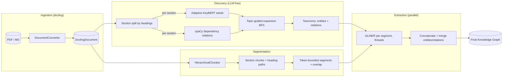

# Architecture

The pipeline builds a knowledge graph from a corpus of documents. It is a **discovery-driven GLiNER assembly**: the graph's taxonomy (entity and relation labels) is *discovered from the data itself*, deterministically and without an LLM, and then GLiNER extracts the final graph using exactly that taxonomy.

## The pipeline at a glance



The five stages:

1. **Ingestion** — read documents (PDF / markdown / txt) and keep a structured `DoclingDocument` when available. Sources plug in behind a common `DataSource` interface. → [ingestion](ingestion.md)
2. **Discovery** — per document section: Adaptive KeyBERT seeds the topics, spaCy derives relations from dependency trees, and a BFS grows the topic graph from the seeds. The discovered nodes and edges become the label taxonomy. → [discovery](discovery.md)
3. **Assembly** — GLiNER extracts entities and relations using exactly the discovered taxonomy (underscore-joined labels); entities are normalized and near-duplicates merged. → [assembly](assembly.md)
4. **Segmentation** — long documents are split into section-aware, token-bounded segments and GLiNER runs over every segment in parallel, concatenating the results — beats GLiNER's 1024-token window. → [segmentation](segmentation.md)
5. **Corpus merge** — scaling to a folder of documents: sequential per-document taxonomy + segmentation, then parallel extraction across all segments (thread pool), and a merged cross-document graph with a common/unique originality view. → [corpus](corpus.md)

## Module map

```
backend/src/kgraph/
├── ingestion/            # sources + parsers
│   ├── base.py           #   DataSource interface (fetch() → list[RawDocument])
│   ├── factory.py        #   build_data_source() (local_files | arxiv)
│   ├── local_files.py    #   LocalFileSource (txt/md/json/pdf from a folder)
│   ├── arxiv.py          #   ArxivSource (arXiv API → RawDocument + PDF download)
│   └── parsers/parsers.py#   docling-based PDF parsing (offline, HF_HUB_OFFLINE=1)
├── discovery/            # stages 1–3 (LLM-free)
│   ├── dependency_relations.py  #   DependencyRelationExtractor (spaCy)
│   ├── topic_graph.py           #   TopicGraph (BFS expansion from seeds)
│   ├── assembly.py              #   DiscoveryAssembly (discovery → GLiNER taxonomy)
│   └── schemas.py               #   DiscoveredRelation, DiscoveryResult
├── extractors/           # final extraction (stage 4)
│   ├── key_bert.py       #   AdaptiveKeyBERT (seeds)
│   ├── gliner.py         #   GLiNERGraph (add_entity/add_relation/find_entity)
│   ├── normalization.py  #   canonical(), EntityMerger
│   └── base.py
├── segmentation/         # stage 5
│   ├── chunker.py        #   Segmenter (HierarchicalChunker + token budget + overlap)
│   ├── extractor.py      #   SegmentedGraphExtractor (parallel GLiNER per segment)
│   └── models.py
├── corpus/               # stage 6
│   ├── merge.py          #   CorpusGraphBuilder (per-doc taxonomies, common/unique)
│   └── viz.py            #   interactive HTML export
├── graph/
│   ├── models.py         #   Entity, Relation, RawDocument
│   └── config.py         #   PipelineConfig (+ load/build_pipeline_config)
├── ingestion/arxiv.py    # (arXiv source, see above)
├── llms/                 # optional LLM route (qwen-demo only)
│   ├── litellm_client.py #   LiteLLMClient (Ollama, structured output)
│   └── schemas/concepts.py
├── retriever/            # GLiNER-based retrieval over the graph
└── cli/                  # the demo entry points (see [Demos](../demos.md))
```

## Key design decisions

- **Labels are discovered, not hand-written.** Both the entity and the relation taxonomy emerge from the document via deterministic dependency parsing. GLiNER is only the last stage.
- **Discovery is LLM-free and deterministic.** A small local model (Qwen3 0.6b) hallucinated evidence during early exploration, so it was dropped from discovery entirely.
- **One taxonomy per document (or per section).** Discovery runs per document section so the vocabulary stays faithful to the content instead of abstract-level boilerplate.
- **Everything is local.** No paid per-token APIs; models run from a local `models/` cache.

## Page index

- [Ingestion](ingestion.md) — sources, parsers, and how documents become `RawDocument`s
- [Discovery](discovery.md) — stages 1–3: Adaptive KeyBERT, spaCy relations, BFS expansion
- [Assembly](assembly.md) — stage 4: the discovered taxonomy drives GLiNER; normalization and merging
- [Segmentation](segmentation.md) — stage 5: beating the 1024-token window
- [Corpus & multi-document](corpus.md) — stage 6: the cross-document originality view
- [Data model & configuration](data-model.md) — `Entity`, `Relation`, `RawDocument`, and `params.yaml`
