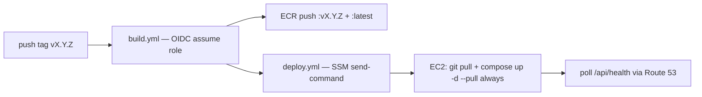

# Build, deploy & AWS account bootstrap (design → provisioning)

> **Status: provisioning, first slice done.** The account now exists (new AWS
> experience, selected Region **`eu-north-1`**, profile `default`) and the first
> Terraform slice (EC2 + wake Lambda + auto-stop scheduler + static S3/CloudFront
> site) is written on branch `ft/aws-deploy` (`infra/terraform/`) — see
> [AWS on-demand deployment](aws-ondemand.md). **What follows is still to build:**
> container/pipeline files, ECR, OIDC CI auth, SSM deploys, first release.
> Decisions locked in so far (see [Deployment](deployment.md)):
> **OIDC** auth from CI, **models baked into the image**, **SSM Run Command** to
> deploy, **git tag → release** trigger, **Terraform** to provision the EC2.

## Stage 0 — AWS account (done via the new AWS experience)

1. ✅ **Account exists** — signed up through the **new AWS experience**
   (project model, social sign-in). Account id `184463060626`.
2. ✅ **Access configured** — AWS CLI v2 (2.36.x, `~/.local/bin`) with profile
   `default`; credentials refresh every 90 days and are cached ~12 h, so a session
   may need re-auth (`aws sso login`-style refresh) after inactivity.
3. ⬜ **MFA / root protection** — confirm browser sign-in uses MFA in the new
   experience before relying on it long-term.
4. ✅ **Primary region chosen = selected Region `eu-north-1`** (Stockholm) — every
   regional resource lives here; CloudFront is global and allowed, many services
   (e.g. App Runner) don't exist in this Region — check availability before
   designing around one.
5. ⬜ **Cost guardrails** — set a budget alert / spend limit in **AWS Settings >
   Billing** so nothing runs away; even with the on-demand model a forgotten VM
   burns the `$200` (mitigated further by the auto-stop schedule — see
   [AWS on-demand deployment](aws-ondemand.md)).
6. ⬜ *(For the GitHub side)* confirm the **GitHub Org/User** for CI is
   `AlbertoVilla87`/`kgraph` — this is the value Terraform pins in the OIDC trust
   condition.

> **Runbook deps flagged here:** Route 53 TLS needs a real **domain** you own
> (AWS-hosted zone + ACM certificate). If you don't have one, the first cut can
> deploy on the **Elastic IP + HTTP** (or a self-signed cert) and add the domain
> later — see Open decisions.

## Stage 1 — Container & pipeline files (this repo)

```
kgraph/
├── .github/workflows/
│   ├── build.yml        # build imágenes backend+frontend → ECR   (tag/manual)
│   └── deploy.yml       # SSM send-command sobre el EC2           (manual, tras build)
├── Dockerfile.backend    # uv sync + modelos horneados; HF_HUB_OFFLINE=1 en runtime
├── frontend/Dockerfile   # multi-stage: vite build → nginx (dist/ + proxy /api)
├── docker/
│   └── nginx.conf        # SPA y proxy_pass /api → backend:8000
├── docker-compose.yml    # fuente de verdad: nginx + backend (+ ollama opcional)
├── .env.example          # plantilla (same compose vale para local y EC2)
├── .env                  # gitignored — real sobre el EC2
└── scripts/ec2-provision.sh  # bootstrap único del host (docker, dirs, ~/kgraph)
```

Key choices encoded here:

- `docker-compose.yml` at repo root is the single source of truth — the same
  file runs against the EC2 (via `git pull` on the repo clone) and locally
  during development, keeping parity.
- **Models baked in the image** (`Dockerfile.backend` downloads GLiNER,
  MiniLM/sentence-transformers, spaCy `en_core_web_sm`, docling hub cache and
  then sets `HF_HUB_OFFLINE=1`) — reproducible large image, no EBS model
  dependency.
- **PDFs are not persisted**: `data/` is an ephemeral per-run directory inside
  the backend container, discarded after each analysis — no EBS data volume.
  The EC2 is nearly disposable (rebuild = clone + compose up + pull images).
- **No port 22** anywhere: the box is reachable over **SSM**; config and
  Compose file get to the instance by `git pull`, deploy runs
  `docker compose up -d --pull always`.

## Stage 2 — Terraform infra module

The first slice exists on branch `ft/aws-deploy` (**`infra/terraform/`**, flat single
stack, one selected region) and is `plan`-validated. Layout:

```
infra/terraform/
├── main.tf            # provider (eu-north-1) + account data source
├── variables.tf       # instance_type, auto_stop_seconds, bucket name, …
├── locals.tf          # computed names (e.g. the wake function ARN)
├── ec2.tf             # AMI lookup, instance, SG (80/443), EIP, SSM profile, user_data
├── iam.tf             # roles: instance (SSM) + wake Lambda + scheduler
├── lambda.tf          # wake function + public function URL + logs + invoke permission
├── s3.tf             # frontend bucket (private) + CloudFront OAC distribution
├── outputs.tf         # instance id, public IP, wake/stop URLs, frontend URL
└── lambda/start_instance.py   # the "start on demand / arm auto-stop" handler
```

See [AWS on-demand deployment](aws-ondemand.md) for the full walkthrough of what
each part does and how to operate it.

Resources the full plan creates (✅ = already in the first slice):

| Resource | ✅ | Notes |
|---|---|---|
| **EC2 `t3.large` (first slice) / `t3.xlarge` (full)** | ✅ | AL2023 AMI; `user_data` installs Docker; root EBS `gp3` (~30 GiB, encrypted) — **no data volume** (PDFs ephemeral) |
| **Elastic IP** | ✅ | static public IPv4; ~`$3.6/mo` while the VM is stopped |
| **Security group** | ✅ | inbound 443 (nginx TLS) + 80 (HTTP demo), **22 closed** |
| **Instance profile** | ✅ | `AmazonSSMManagedInstanceCore` so SSM works |
| **Wake Lambda + function URL** | ✅ | `GET /` starts the VM, waits for `running`, returns the IP; `?action=stop` stops it |
| **Auto-stop scheduler** | ✅ | one-shot EventBridge schedule (default 3 h) created per start — anti-forget |
| **Frontend S3 bucket + CloudFront** | ✅ | private bucket, OAC, SPA fallback; the site is always up |
| **CloudWatch** | ✅ | Lambda logs (7-day retention); instance agent logs later |
| **Route 53 / ACM** | ⬜ | DNS + TLS; needs a domain you own (fallback: EIP + HTTP meanwhile) |
| **IAM OIDC provider + CI role** | ⬜ | `token.actions.githubusercontent.com`, trust pinned to `repo:AlbertoVilla87/kgraph`; ECR push + SSM `send-command` |
| **ECR repos** `kgraph/backend`, `kgraph/frontend` | ⬜ | images pushed from CI, pulled on the EC2 |

## Stage 3 — CI/CD (GitHub Actions)

**No static credentials.** GitHub assumes the Terraform-created role via OIDC:



`build.yml` skeleton (trigger: `v*` tag or `workflow_dispatch`):

```yaml
name: build
on:
  push:
    tags: ["v*"]
  workflow_dispatch:
jobs:
  images:
    runs-on: ubuntu-latest
    permissions:
      id-token: write
      contents: read
    steps:
      - uses: actions/checkout@v4
      - uses: aws-actions/configure-aws-credentials@v4
        with:
          role-to-assume: arn:aws:iam::${{ secrets.AWS_ACCOUNT_ID }}:role/github-actions-ecr
          aws-region: eu-north-1
      # docker buildx build → ECR: kgraph/backend, kgraph/frontend
      # tags: $GITHUB_REF_NAME (vX.Y.Z) + latest
```

`deploy.yml` skeleton (trigger: `workflow_dispatch`, input `ref`/image tag):

```yaml
name: deploy
on:
  workflow_dispatch:
    inputs:
      ref: { type: string, default: latest }
jobs:
  deploy:
    runs-on: ubuntu-latest
    permissions: { id-token: write, contents: read }
    steps:
      - uses: aws-actions/configure-aws-credentials@v4
        with:
          role-to-assume: arn:aws:iam::${{ secrets.AWS_ACCOUNT_ID }}:role/github-actions-ssm
          aws-region: eu-north-1
      - name: Compose up on EC2
        run: aws ssm send-command --instance-ids ${{ vars.EC2_INSTANCE_ID }} \
              --document-name AWS-RunShellScript \
              --parameters command=["cd ~/kgraph && git pull && docker compose up -d --pull always"]
```

## First release (runbook)

1. `git tag v0.1.0 && git push --tags` → `build.yml` pushes `:v0.1.0` + `:latest`.
2. `deploy.yml` (dispatch) → SSM pulls and restarts on the EC2.
3. `curl https://<dns>/api/health` → `{"status":"ok"}`.

## Open decisions

- **Domain**: do you own one for Route 53 + ACM? Fallback: Elastic IP + HTTP until then.
- **Region**: `eu-north-1` (selected Region — fixed for this new-AWS-experience
  project; Terraform pins it).
- **tfstate backend**: local file now, S3 bucket later (needs the account to exist first).
- **`.env` handling**: commit a `.env.example` only; real `.env` lives on the box,
  injected initially through SSM during provision.
- **Local parity**: get `docker compose up` working for development before the first
  EC2 deploy — same file, same behavior.