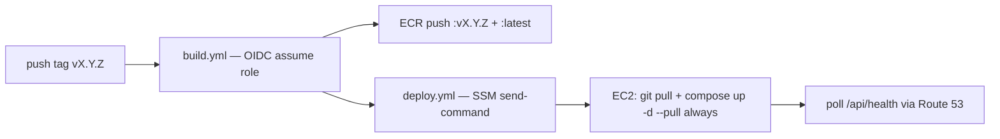

# Build, deploy & AWS account bootstrap (design)

> **Status: design.** No AWS account exists yet. This page is the full plan from
> zero: account bootstrap → container/pipeline files → Terraform infra module →
> first release. Decisions locked in so far (see [Deployment](deployment.md)):
> **OIDC** auth from CI, **models baked into the image**, **SSM Run Command** to
> deploy, **git tag → release** trigger, **Terraform** to provision the EC2.

## Stage 0 — AWS account (prerequisite, not started)

1. **Create the account** at aws.amazon.com using a dedicated root email (not a
   shared inbox). Store the root credentials in a password manager.
2. **Enable MFA on the root user immediately** (hardware key or TOTP app).
3. **Enable AWS Cost Explorer + a budget alarm** (e.g. hard stop / $20 alert) so
   nothing runs away — `t3.xlarge` is ~$75/mo of the budget envelope.
4. **Pick a primary region.** Recommended: `eu-west-1` (Ireland) — good reach
   from EU, and the default choice for the resources below.
5. **Daily-use access** (never root): IAM Identity Center (preferred) or a single
   IAM user with MFA. Install **AWS CLI v2** (`brew install awscli`) and log in.
6. *(Later, for the GitHub side)* decide whether the **GitHub Org/User** for CI
   is `AlbertoVilla87`/`kgraph` — this is the value Terraform pins in the OIDC
   trust condition.

> **Runbook deps flagged here:** Route 53 TLS needs a real **domain** you own
> (AWS-hosted zone + ACM certificate). If you don't have one, the first cut can
> deploy on the **Elastic IP + HTTP** (or a self-signed cert) and add the domain
> later — see Open decisions.

## Stage 1 — Container & pipeline files (this repo)

```
kgraph/
├── .github/workflows/
│   ├── build.yml        # build imágenes backend+frontend → ECR   (tag/manual)
│   └── deploy.yml       # SSM send-command sobre el EC2           (manual, tras build)
├── Dockerfile.backend    # uv sync + modelos horneados; HF_HUB_OFFLINE=1 en runtime
├── frontend/Dockerfile   # multi-stage: vite build → nginx (dist/ + proxy /api)
├── docker/
│   └── nginx.conf        # SPA y proxy_pass /api → backend:8000
├── docker-compose.yml    # fuente de verdad: nginx + backend (+ ollama opcional)
├── .env.example          # plantilla (same compose vale para local y EC2)
├── .env                  # gitignored — real sobre el EC2
└── scripts/ec2-provision.sh  # bootstrap único del host (docker, dirs, ~/kgraph)
```

Key choices encoded here:

- `docker-compose.yml` at repo root is the single source of truth — the same
  file runs against the EC2 (via `git pull` on the repo clone) and locally
  during development, keeping parity.
- **Models baked in the image** (`Dockerfile.backend` downloads GLiNER,
  MiniLM/sentence-transformers, spaCy `en_core_web_sm`, docling hub cache and
  then sets `HF_HUB_OFFLINE=1`) — reproducible large image, no EBS model
  dependency.
- **PDFs are not persisted**: `data/` is an ephemeral per-run directory inside
  the backend container, discarded after each analysis — no EBS data volume.
  The EC2 is nearly disposable (rebuild = clone + compose up + pull images).
- **No port 22** anywhere: the box is reachable over **SSM**; config and
  Compose file get to the instance by `git pull`, deploy runs
  `docker compose up -d --pull always`.

## Stage 2 — Terraform infra module

```
infra/
├── main.tf            # backend(tfstate), provider, module wiring
├── variables.tf
├── outputs.tf         # instance id, public dns/ip, iam role arn
└── modules/
    ├── oidc/          # GitHub OIDC provider + IAM role (trust: repo AlbertoVilla87/kgraph)
    └── ec2/           # instancia, SG, EBS, Route 53, SSM instance profile
```

Resources Terraform creates:

| Resource | Notes |
|---|---|
| **IAM OIDC provider** | `token.actions.githubusercontent.com`, audience `sts.amazonaws.com` |
| **IAM role for CI** | trust condition pinned to `repo:AlbertoVilla87/kgraph:*`; policies: ECR push (`kgraph/backend`, `kgraph/frontend`), SSM `send-command`, minimal read |
| **EC2 `t3.xlarge`** | AL2023 AMI; `user_data` runs `ec2-provision.sh`; root EBS `gp3` (~30 GiB) — **no data volume** (PDFs ephemeral) |
| **Instance profile** | `AmazonSSMManagedInstanceCore` so SSM works |
| **Security group** | inbound 443 (→ nginx TLS; optionally 80 redirect), **22 closed** |
| **Elastic IP / Route 53** | A record to the instance; ACM cert when a domain exists |
| **CloudWatch** | logs from SSM + agent; cost guardrails |

## Stage 3 — CI/CD (GitHub Actions)

**No static credentials.** GitHub assumes the Terraform-created role via OIDC:



`build.yml` skeleton (trigger: `v*` tag or `workflow_dispatch`):

```yaml
name: build
on:
  push:
    tags: ["v*"]
  workflow_dispatch:
jobs:
  images:
    runs-on: ubuntu-latest
    permissions:
      id-token: write
      contents: read
    steps:
      - uses: actions/checkout@v4
      - uses: aws-actions/configure-aws-credentials@v4
        with:
          role-to-assume: arn:aws:iam::${{ secrets.AWS_ACCOUNT_ID }}:role/github-actions-ecr
          aws-region: eu-west-1
      # docker buildx build → ECR: kgraph/backend, kgraph/frontend
      # tags: $GITHUB_REF_NAME (vX.Y.Z) + latest
```

`deploy.yml` skeleton (trigger: `workflow_dispatch`, input `ref`/image tag):

```yaml
name: deploy
on:
  workflow_dispatch:
    inputs:
      ref: { type: string, default: latest }
jobs:
  deploy:
    runs-on: ubuntu-latest
    permissions: { id-token: write, contents: read }
    steps:
      - uses: aws-actions/configure-aws-credentials@v4
        with:
          role-to-assume: arn:aws:iam::${{ secrets.AWS_ACCOUNT_ID }}:role/github-actions-ssm
          aws-region: eu-west-1
      - name: Compose up on EC2
        run: aws ssm send-command --instance-ids ${{ vars.EC2_INSTANCE_ID }} \
              --document-name AWS-RunShellScript \
              --parameters command=["cd ~/kgraph && git pull && docker compose up -d --pull always"]
```

## First release (runbook)

1. `git tag v0.1.0 && git push --tags` → `build.yml` pushes `:v0.1.0` + `:latest`.
2. `deploy.yml` (dispatch) → SSM pulls and restarts on the EC2.
3. `curl https://<dns>/api/health` → `{"status":"ok"}`.

## Open decisions

- **Domain**: do you own one for Route 53 + ACM? Fallback: Elastic IP + HTTP until then.
- **Region**: `eu-west-1` assumed; confirm before Terraform pins it.
- **tfstate backend**: local file now, S3 bucket later (needs the account to exist first).
- **`.env` handling**: commit a `.env.example` only; real `.env` lives on the box,
  injected initially through SSM during provision.
- **Local parity**: get `docker compose up` working for development before the first
  EC2 deploy — same file, same behavior.