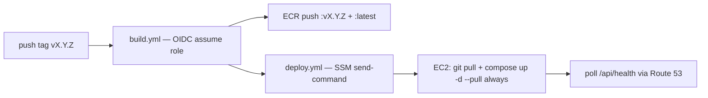

# Build, deploy & AWS account bootstrap

> **Status: implementation merged (PR #45), execution pending.** The account
> exists (new AWS experience, selected Region **`eu-north-1`**, profile `default`),
> the Terraform slice (EC2 + wake Lambda + auto-stop scheduler + static
> S3/CloudFront site) is written (`infra/terraform/`) and the container/pipeline
> files are implemented and merged — Dockerfiles, `docker-compose.yml`,
> `.env.example`, GitHub Actions workflows, `ec2-provision.sh`. What remains is
> **execution**: apply Terraform, create ECR repos / OIDC roles, ECR login on the
> EC2, first release.
> Decisions locked in: **OIDC** auth from CI, **models baked into the image**
> (GLiNER only), **SSM Run Command** to deploy, **manual/`workflow_dispatch`** deploy
> trigger, **git tag → build** trigger, **Terraform** to provision the EC2.
> Follow the operational steps in the [Deployment Runbook](deployment.md).

## Stage 0 — AWS account (done via the new AWS experience)

1. ✅ **Account exists** — signed up through the **new AWS experience**
   (project model, social sign-in). Account id `184463060626`.
2. ✅ **Access configured** — AWS CLI v2 (2.36.x, `~/.local/bin`) with profile
   `default`; credentials refresh every 90 days and are cached ~12 h, so a session
   may need re-auth (`aws sso login`-style refresh) after inactivity.
3. ⬜ **MFA / root protection** — confirm browser sign-in uses MFA in the new
   experience before relying on it long-term.
4. ✅ **Primary region chosen = selected Region `eu-north-1`** (Stockholm) — every
   regional resource lives here; CloudFront is global and allowed, many services
   (e.g. App Runner) don't exist in this Region — check availability before
   designing around one.
5. ⬜ **Cost guardrails** — set a budget alert / spend limit in **AWS Settings >
   Billing** so nothing runs away; even with the on-demand model a forgotten VM
   burns the `$200` (mitigated further by the auto-stop schedule — see
   [AWS on-demand deployment](aws-ondemand.md)).
6. ⬜ *(For the GitHub side)* confirm the **GitHub Org/User** for CI is
   `AlbertoVilla87`/`kgraph` — this is the value Terraform pins in the OIDC trust
   condition.

> **Runbook deps flagged here:** Route 53 TLS needs a real **domain** you own
> (AWS-hosted zone + ACM certificate). If you don't have one, the first cut can
> deploy on the **Elastic IP + HTTP** (or a self-signed cert) and add the domain
> later — see Open decisions.

## Stage 1 — Container & pipeline files (implemented)

All container/pipeline files now exist in this repo:

```
kgraph/
├── .github/workflows/
│   ├── build.yml        # build imágenes backend+frontend → ECR   (tag/manual)
│   └── deploy.yml       # SSM send-command sobre el EC2           (manual, tras build)
├── backend/Dockerfile    # uv sync + modelos horneados; HF_HUB_OFFLINE=1 en runtime
├── frontend/Dockerfile   # multi-stage: vite build → nginx (dist/ + proxy /api)
├── docker/
│   └── nginx.conf        # SPA y proxy_pass /api → backend:8000
├── docker-compose.yml    # fuente de verdad: nginx + backend (+ ollama tras el perfil `citation` — el API lo requiere para analizar)
├── .env.example          # plantilla (same compose vale para local y EC2)
├── .env                  # gitignored — real sobre el EC2
└── scripts/ec2-provision.sh  # bootstrap único del host (docker, dirs, ~/kgraph)
```

Key choices encoded here:

- `docker-compose.yml` at repo root is the single source of truth — the same
  file runs against the EC2 (via `git pull` on the repo clone) and locally
  during development, keeping parity.
- **Models baked in the image** (`backend/Dockerfile` downloads GLiNER (`urchade/gliner_multi-v2.1`)
  then sets `HF_HUB_OFFLINE=1`) — reproducible
  large image, no EBS model dependency. **spaCy and MiniLM are NOT included**
  (no longer used in the pipeline).
- **PDFs are not persisted**: `data/` is an ephemeral per-run directory inside
  the backend container, discarded after each analysis — no EBS data volume.
  The EC2 is nearly disposable (rebuild = clone + compose up + pull images).
- **No port 22** anywhere: the box is reachable over **SSM**; config and
  Compose file get to the instance by `git pull`, deploy runs
  `docker compose up -d --pull always`.

## Stage 2 — Terraform infra module

The first slice exists on branch `ft/aws-deploy` (**`infra/terraform/`**, flat single
stack, one selected region) and is `plan`-validated. Layout:

```
infra/terraform/
├── main.tf            # provider (eu-north-1) + account data source
├── variables.tf       # instance_type, auto_stop_seconds, bucket name, …
├── locals.tf          # computed names (e.g. the wake function ARN)
├── ec2.tf             # AMI lookup, instance, SG (80/443), EIP, SSM profile, user_data
├── iam.tf             # roles: instance (SSM) + wake Lambda + scheduler
├── lambda.tf          # wake function + public function URL + logs + invoke permission
├── s3.tf             # frontend bucket (private) + CloudFront OAC distribution
├── outputs.tf         # instance id, public IP, wake/stop URLs, frontend URL
└── lambda/start_instance.py   # the "start on demand / arm auto-stop" handler
```

See [AWS on-demand deployment](aws-ondemand.md) for the full walkthrough of what
each part does and how to operate it.

Resources the full plan creates (✅ = already in the first slice):

| Resource | ✅ | Notes |
|---|---|---|
| **EC2 `t3.xlarge`** (default) | ✅ | AL2023 AMI; `user_data` installs Docker; root EBS `gp3` (~30 GiB, encrypted) — **no data volume** (PDFs ephemeral) |
| **Elastic IP** | ✅ | static public IPv4; ~`$3.6/mo` while the VM is stopped |
| **Security group** | ✅ | inbound 443 (nginx TLS) + 80 (HTTP demo), **22 closed** |
| **Instance profile** | ✅ | `AmazonSSMManagedInstanceCore` so SSM works |
| **Wake Lambda + function URL** | ✅ | `GET /` starts the VM, waits for `running`, returns the IP; `?action=stop` stops it |
| **Auto-stop scheduler** | ✅ | one-shot EventBridge schedule (default 3 h) created per start — anti-forget |
| **Frontend S3 bucket + CloudFront** | ✅ | private bucket, OAC, SPA fallback; the site is always up |
| **CloudWatch** | ✅ | Lambda logs (7-day retention); instance agent logs later |
| **Route 53 / ACM** | ⬜ | DNS + TLS; needs a domain you own (fallback: EIP + HTTP meanwhile) |
| **IAM OIDC provider + CI role** | ⬜ | `token.actions.githubusercontent.com`, trust pinned to `repo:AlbertoVilla87/kgraph`; ECR push + SSM `send-command` |
| **ECR repos** `kgraph/backend`, `kgraph/frontend` | ⬜ | images pushed from CI, pulled on the EC2 |

## Stage 3 — CI/CD (GitHub Actions)

**No static credentials.** GitHub assumes the Terraform-created role via OIDC:



`build.yml` — **implemented** at `.github/workflows/build.yml` (trigger: `v*` tag or `workflow_dispatch`):

```yaml
name: build
on:
  push:
    tags: ["v*"]
  workflow_dispatch:
jobs:
  images:
    runs-on: ubuntu-latest
    permissions:
      id-token: write
      contents: read
    steps:
      - uses: actions/checkout@v4
      - uses: aws-actions/configure-aws-credentials@v4
        with:
          role-to-assume: arn:aws:iam::${{ secrets.AWS_ACCOUNT_ID }}:role/github-actions-ecr
          aws-region: eu-north-1
      - uses: aws-actions/amazon-ecr-login@v2
        id: ecr
      - name: Set up Docker Buildx
        uses: docker/setup-buildx-action@v3
      - name: Build and push backend
        uses: docker/build-push-action@v6
        with:
          context: .
          file: backend/Dockerfile
          push: true
          tags: |
            ${{ steps.ecr.outputs.registry }}/kgraph/backend:${{ github.ref_name }}
            ${{ steps.ecr.outputs.registry }}/kgraph/backend:latest
          cache-from: type=gha
          cache-to: type=gha,mode=max
      - name: Build and push frontend
        uses: docker/build-push-action@v6
        with:
          context: .
          file: frontend/Dockerfile
          push: true
          tags: |
            ${{ steps.ecr.outputs.registry }}/kgraph/frontend:${{ github.ref_name }}
            ${{ steps.ecr.outputs.registry }}/kgraph/frontend:latest
          cache-from: type=gha
          cache-to: type=gha,mode=max
```

`deploy.yml` — **implemented** at `.github/workflows/deploy.yml` (trigger: `workflow_dispatch`, input `ref`):

```yaml
name: deploy
on:
  workflow_dispatch:
    inputs:
      ref:
        description: "Git ref to deploy (branch, tag, or commit SHA)"
        required: false
        default: "master"
jobs:
  deploy:
    runs-on: ubuntu-latest
    permissions:
      id-token: write
      contents: read
    steps:
      - uses: aws-actions/configure-aws-credentials@v4
        with:
          role-to-assume: arn:aws:iam::${{ secrets.AWS_ACCOUNT_ID }}:role/github-actions-ssm
          aws-region: eu-north-1
      - name: Deploy via SSM
        shell: bash
        run: |
          REF="${{ inputs.ref }}"
          aws ssm send-command \
            --instance-ids "${{ vars.EC2_INSTANCE_ID }}" \
            --document-name "AWS-RunShellScript" \
            --parameters "commands=[
              'cd /home/ec2-user/kgraph',
              'git fetch origin',
              'git checkout $REF',
              'git reset --hard origin/$REF',
              'docker compose pull',
              'docker compose up -d --remove-orphans'
            ]"
      - name: Wait for healthcheck
        run: |
          for i in $(seq 1 60); do
            if curl -sf "http://${{ vars.EC2_PUBLIC_IP }}/api/health" > /dev/null 2>&1; then
              echo "Backend healthy"; exit 0
            fi
            sleep 10
          done
          exit 1
```

> **Note:** the first-time ECR push includes models baked into the image
> (GLiNER ~2.5 GB). Expect the build to take several minutes and
> the resulting image to be large — use `docker buildx` cache (as above) to
> speed up rebuilds.

## Execution steps (what remains)

All code is merged; these are the remaining **one-time operational actions** to
go live. Each maps to a section of the [Deployment Runbook](deployment.md):

1. **Apply Terraform** (Runbook §1) — creates the EC2, wake Lambda, auto-stop
   scheduler, S3/CloudFront site and IAM roles. Outputs: instance id, public IP,
   wake URL.
2. **Create ECR repos** (Runbook §3) — `kgraph/backend` + `kgraph/frontend`.
3. **Create OIDC provider + CI roles** — GitHub Actions assumes these via OIDC
   (no static creds); still to add to `infra/terraform/` (marked ⬜ in Stage 2).
4. **Set GitHub secrets/vars** (Runbook §3) — `AWS_ACCOUNT_ID`, `EC2_INSTANCE_ID`,
   `EC2_PUBLIC_IP`.
5. **Provision the EC2** (Runbook §2) — run `ec2-provision.sh` (clone repo,
   create `.env`, `docker compose up`).
6. **ECR login on the EC2** — instance profile needs `AmazonEC2ContainerRegistryReadOnly`
   so `docker compose pull` can fetch the private images.
7. **First release** (below) — tag `v0.1.0`, then deploy.

## First release (runbook)

1. `git tag v0.1.0 && git push --tags` → `build.yml` pushes `:v0.1.0` + `:latest`.
2. `deploy.yml` (dispatch) → SSM pulls and restarts on the EC2.
3. `curl https://<dns>/api/health` → `{"status":"ok"}`.

## Open decisions

- **Domain**: do you own one for Route 53 + ACM? Fallback: Elastic IP + HTTP until then.
- **Region**: `eu-north-1` (selected Region — fixed for this new-AWS-experience
  project; Terraform pins it).
- **tfstate backend**: local file now, S3 bucket later (needs the account to exist first).
- **`.env` handling**: commit a `.env.example` only; real `.env` lives on the box,
  injected initially through SSM during provision.
- **Local parity**: get `docker compose up` working for development before the first
  EC2 deploy — same file, same behavior.