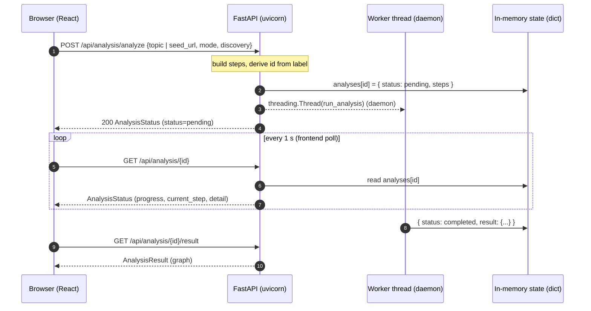
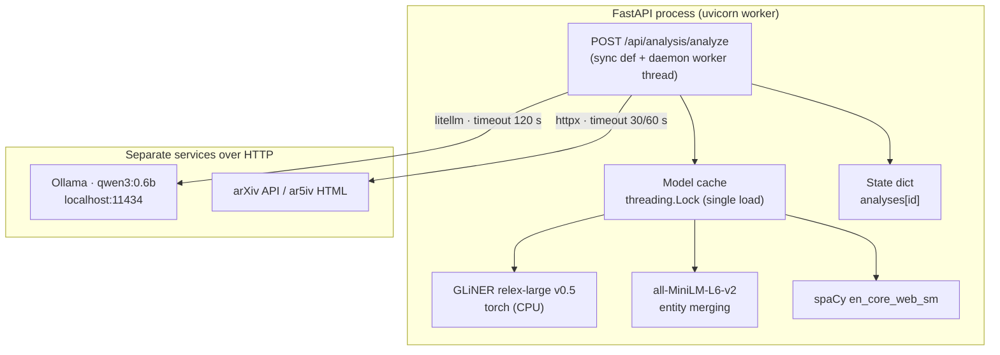
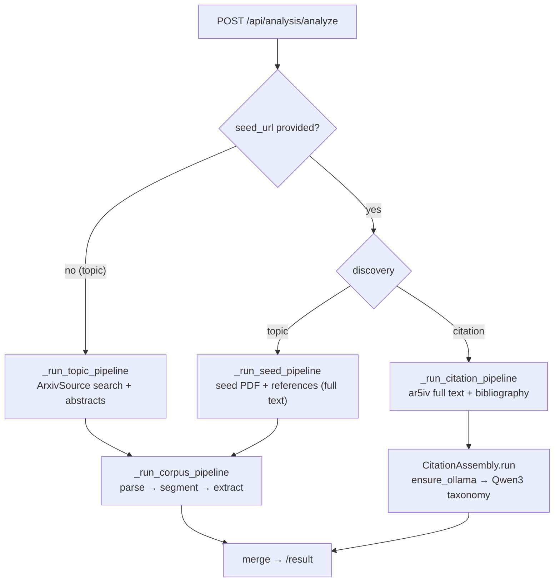
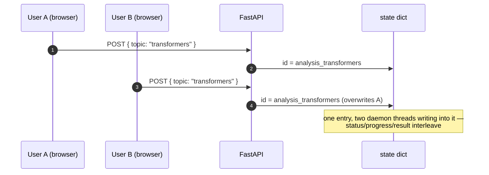

# Runtime & API architecture

This page documents how the **live API** behaves end-to-end: the request →
response lifecycle, how the pipeline is composed at runtime (in-process models
vs. network services), the concurrency model, and the current gaps — together
with the diagrams an architecture review would expect (sequence, components,
flow).

It complements the [deployment](deployment.md) page (target AWS topology), the
[application architecture](app-architecture.md) diagram (single process, state
& pipeline) and the [CI/CD pipelines](pipelines.md) page (how it gets there).
This page keeps the request-level detail; that diagram is the visual overview.

---

## 1. Request → response lifecycle (job + polling)

The analysis API does **not** process inline. It implements the classic
**job + polling** pattern: `POST` starts an analysis, a background thread runs
the pipeline, and the client polls for status until a final `GET` fetches the
result.

**Endpoints** (all sync `def`, no `async def`):

| Endpoint | Purpose |
| --- | --- |
| `POST /api/analysis/analyze` | Start an analysis. Returns `AnalysisStatus` immediately (`pending`). |
| `GET /api/analysis/{id}` | Poll the job: `status`, `progress`, `current_step`, `steps[]`, `detail`, `error`. |
| `GET /api/analysis/{id}/result` | Fetch the final graph (`topics`, `relationships`, `stats`) once `completed`. |



Implementation anchors:

- `POST` handler + thread spawn: `backend/src/kgraph/api/routers/analysis.py:58` (`threading.Thread(target=run_analysis, daemon=True)` at `analysis.py:124`).
- Status + result handlers: `analysis.py:130` and `analysis.py:137`.
- Worker/pipeline: `backend/src/kgraph/api/runner.py:31` (`run_analysis`).
- Shared state (plain in-memory dict): `backend/src/kgraph/api/state.py`.
- Frontend already polls every second and reads the result:
  `frontend/src/pages/Overview.tsx:60` — `API_BASE = '/api'` (Vite proxy → `localhost:8000`), `setTimeout(() => pollStatus(id), 1000)` at `Overview.tsx:78`.

There is **no queue** — one daemon thread per request, state lives in RAM.
There is **no streaming** (no SSE / WebSocket) today. See §4 for the gaps.

---

## 2. Pipeline composition at runtime

Two very different execution domains:

- **In-process (same Python process as FastAPI):** the local models —
  GLiNER (`models/gliner-relex-large-v0.5`), MiniLM (`models/all-MiniLM-L6-v2`)
  and spaCy (`en_core_web_sm`) — run inside the uvicorn worker via
  torch / sentence-transformers. Their (heavy) load is serialized behind a
  global lock (`backend/src/kgraph/extractors/model_cache.py:3`).
- **Network (separate services, HTTP):** inference for the LLM route goes to
  **Ollama** at `http://localhost:11434` through LiteLLM
  (`backend/src/graph/config.py:63`), and document retrieval goes to
  **arXiv / ar5iv** over HTTPS.



Key facts:

- **Qwen3 + Ollama is the only network inference.** Everything else is local
  and LLM-free. `ensure_ollama()` even auto-launches `ollama serve` when it is
  not running (`backend/src/kgraph/discovery/citation_graph.py:76`).
- Reference fetching is parallelized with `ThreadPoolExecutor(max_workers=min(8, n))`
  (`runner.py:415`); the **models are not** multi-worker.
- Memory/GPU hygiene happens at the end of a run: `gc.collect()`,
  `torch.set_num_threads(1)` and explicit MPS/CUDA cache clearing
  (`runner.py:74` and `runner.py:678`).

---

## 3. Pipeline dispatch (discovery)

`run_analysis` branches on two axes: whether a `seed_url` or a `topic` was
provided, and whether discovery is `topic` (KeyBERT + spaCy, LLM-free) or
`citation` (seed's bibliography → Qwen3 taxonomy). Every pipeline is "deep":
it parses full text and segments documents before extraction.



---

## 4. Concurrency model

There is no worker/thread-pool configuration anywhere in the repo
(`backend/pyproject.toml` only pins `uvicorn>=0.32`; no gunicorn, no
`--workers`). The proposed nginx/uvicorn settings live only in the
[deployment](deployment.md) design. Three concrete risks follow from the
current design:

**1. ID collision between concurrent users.** The analysis id is derived from
the label, not a UUID (`analysis.py:67`):

```python
analysis_id = f"analysis_{(label or 'unknown').replace('/', '_')...lower()}"
```

Two users analyzing the **same topic** share one dict key — the second `POST`
overwrites the first entry while both threads keep writing to it.



**2. Model contention.** Models are process-global and their load is serialized
by one lock; concurrent runs share GIL/torch threads and step on each other's
memory cleanup (`runner.py:678` clears caches per run while another run may be
mid-extraction).

**3. State volatility.** `analyses` lives in a plain dict (`state.py`) — it is
lost on restart, invisible across uvicorn workers, and unsafe under `--workers
> 1`. It is fine for single-process local use, wrong for a multi-worker
deployment.

No test or log exercises two simultaneous requests today. Ollama, by contrast,
queues concurrent requests internally and is safe under concurrency.

---

## 5. Latency

The API adds no timing logs or metrics. The only measured numbers come from
the CLI corpus demo (`backend/reports/corpus_timing_2d91bd8.json`, deep mode,
5 local PDFs, macOS — see [`reports/corpus_timing.ipynb`](../reports/corpus_timing.ipynb)):

| Phase | Time (deep, 5 PDFs, local) |
| --- | --- |
| model load | 7.1 s |
| fetch + parse | 21.1 s |
| taxonomy | 40.5 s |
| extraction | 187.4 s |
| **total** | **≈ 4.3 min** |

The full-text + segmentation pipeline runs to completion in about 4.3 min, so
a synchronous HTTP response is not viable — the job +
polling pattern is the right call, and `proxy_read_timeout` / LLM timeouts are
already sized for it (litellm `timeout=120` at `citation_graph.py:230`; httpx
read timeout 60 s in the citation fetcher).

---

## 6. What exists vs. what's missing

| Capability | Status |
| --- | --- |
| Job start + status polling | ✅ Implemented (`POST /analyze`, `GET /{id}`) |
| Result retrieval (`GET /{id}/result`) | ✅ Implemented |
| Frontend polling (1 s) | ✅ Implemented (`Overview.tsx`) |
| Unique job ids | ❌ Derived from label → collisions |
| Queued / bounded concurrency | ❌ One raw daemon thread per request |
| Durable / shared state across workers | ❌ In-memory dict |
| Streaming (SSE / WebSocket) | ❌ Not present |
| Timing logs / metrics | ❌ Only CLI reports |

**Recommended evolution** (low effort, no breaking change to the current API):

1. **Unique ids** — use `uuid4` instead of the label-derived id (`analysis.py:67`);
   keep the label only as a display field.
2. **Bounded concurrency** — replace the bare daemon thread with a small
   worker pool (e.g. `ThreadPoolExecutor(max_workers=4)`) + a per-analysis
   lock in `state.py`, so two identical analyses serialize instead of
   colliding.
3. **Durable state (pre-deployment)** — move `analyses` out of `state.py`
   into something shared (Redis or SQLite) so `--workers > 1` and restarts do
   not lose jobs.
4. **Optional SSE** — add `GET /api/analysis/{id}/stream` emitting
   `current_step`/`progress` events from the worker; the frontend swaps
   `setTimeout(..., 1000)` for an `EventSource`. Backend already carries the
   per-step state needed to emit these. Nice for UX, not a blocker.

`Starlette BackgroundTasks` adds nothing over the existing thread (same
process, same volatility) — it would be a cosmetic refactor, not a fix.

---

See [Deployment](deployment.md) for the target topology, and
[Pipelines](pipelines.md) for how the API is packaged, tested, and shipped.