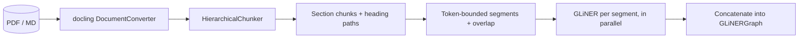

# Segmentation — stage 4 (beating the 1024-token window)

GLiNER truncates any input longer than its context window (`max_len` from the model's `gliner_config.json`, 1024 for relex-large). `kgraph/segmentation/` splits the document into segments that fit the window, keeps the section structure, and runs the extraction in parallel:



1. **Docling owns the parsing.** `parse_pdf_full` / `parse_pdf_document` keep the structured `DoclingDocument` (previously only its markdown export was kept), and `LocalFileSource`/`ArxivSource` attach it to `RawDocument.docling_doc`.
2. **`HierarchicalChunker`** (`docling_core.transforms.chunker`) turns the document into layout/section chunks, each carrying its heading path (`meta.headings`). Chunks without a heading inherit the previous one, so captions/figures keep their section context.
3. **`Segmenter`** (`kgraph/segmentation/chunker.py`) re-merges consecutive chunks up to the token budget (default `segmentation.max_tokens`, capped at the model's `max_len`), splits oversized sections at paragraph → sentence → token boundaries, prepends the heading path to each segment as context, and carries an `overlap_tokens` tail across boundaries so entities/relations spanning a cut are still seen. Token counting uses the GLiNER model's own tokenizer, so the budget matches the model exactly.
4. **`SegmentedGraphExtractor`** (`kgraph/segmentation/extractor.py`) runs `model.inference` over every segment concurrently (one shared model, one Python thread per worker; torch releases the GIL during inference) and **concatenates** the per-segment `Entity`/`Relation` lists into a `GLiNERGraph`. The existing merge logic in `add_entity`/`add_relation` — canonical dedup, best-score, mention accumulation, relation `count` — is exactly the concatenation machinery: the same entity found in five sections becomes one node with five mentions, and each mention records its `segment` index for provenance.
5. **Segmentation is the parallelization unit.** Discovery produces one taxonomy per document (each reference gets its own Qwen-derived labels, the seed gets the union), then `SegmentedGraphExtractor` runs GLiNER over every segment of the document concurrently. The per-segment results are concatenated into the same `GLiNERGraph` via the merge logic in `add_entity`/`add_relation` — the same entity found in five sections becomes one node with five mentions, and each mention records its `segment` index for provenance.

## Configuration

Under `segmentation` in `backend/configs/params.yaml`:

| Key | Default | Meaning |
| --- | --- | --- |
| `enabled` | `true` | Use the segmented extractor in the assembly pipeline |
| `max_tokens` | `1024` | Token budget per segment (capped at the model's `max_len`) |
| `overlap_tokens` | `64` | Overlap carried across segment boundaries so cross-cut entities/relations are captured |
| `workers` | `0` | Parallel extraction workers; `0` = half the CPUs |

## Demo output (medium case, segmented)

On the legacy `medium.txt` demo (2388 tokens, previously truncated to the first 1024) segmentation raised the extraction from **4 entities / 2 relations** to **10 entities and 8 unique relations** — the tail of the document is analyzed instead of discarded. On a long arXiv paper (6589 tokens) the segmenter yields 10 section-aware segments processed in ~9 s and a graph whose nodes accumulate mentions from up to 5 different sections each. Segmentation runs by default inside the production pipeline:

```sh
uv run citation-demo --seed 2404.16130   # segmentation is enabled by default
```

## Known limitations

- Threads share one GLiNER model; when `workers > 1` torch intra-op threads are pinned to 1 to avoid oversubscription. For very large corpora a process-per-worker (one model copy each) is the natural scaling step.
- Cached `.md` files re-read from disk have no `DoclingDocument` (`docling_doc` is only attached on a fresh parse); the `Segmenter` falls back to a markdown-heading splitter that behaves identically for plain text.
