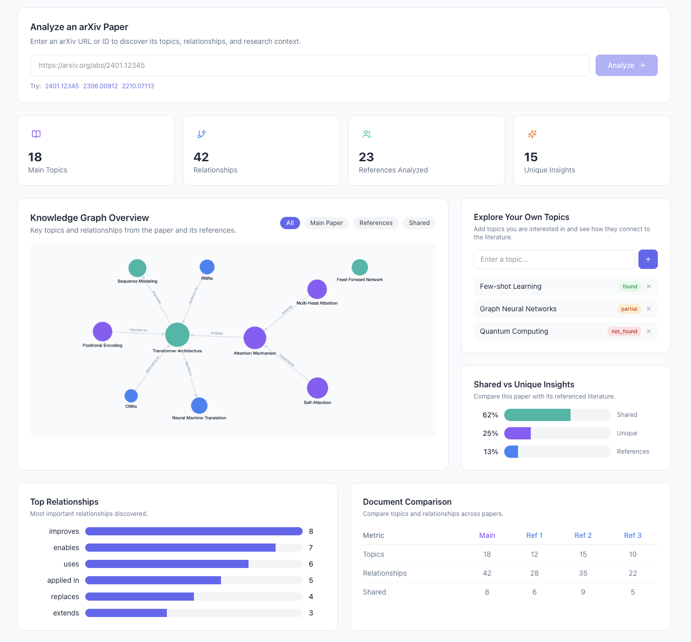

# Astrolabe

> **Astrolabe** — the instrument that mapped the heavens and guided exploration. This tool does the same for the state of the art of any research topic: it maps the field as a knowledge graph, lets you navigate it, and points at what is original and what is missing.



A tool to know the **state of the art of any topic** from the research sources that matter (arXiv, IEEE, ...) and to act on it:

- **Map the field** — an accumulated knowledge graph per topic shows the concepts and how they relate, with confidence and frequency.
- **Spot originality** — a new paper or idea compared against the accumulated graph reveals novel nodes, edges, and combinations even when the wording overlaps with prior work.
- **Find the gaps** — rare or absent concepts/relations are inspiration for unexplored directions.
- **Check an idea instantly** — because GLiNER is zero-shot, any topic the user thinks of becomes a label, and we can ask whether it appears in the corpus and how it connects.

## The problem

Knowing the *state of the art* of any topic is hard. Research piles up fast (arXiv, IEEE, RSS feeds...) and most papers say the same thing in different words. Reading it all — or asking an LLM to summarize it — doesn't scale and doesn't accumulate: an LLM has no persistent memory of everything published on a topic, and lexical similarity misses cases where the *wording* is new but the *idea* isn't — or the reverse, where the wording is generic but the combination of ideas genuinely is new. On top of that, researchers need to spot what has **not** been done yet: the gaps worth exploring.

## The idea

<table>
<tr>
<td width="70%">

Build an **accumulated knowledge graph per topic** from the actual research sources (arXiv, IEEE), and use it to answer three questions:

1. **What is the state of the art?** — the structure of the topic graph (the concepts and how they relate, their confidence and frequency) is a map of the field as it stands today.
2. **What is original?** — a new paper, post, or idea is compared against the accumulated topic graph: novel nodes, novel edges, and novel combinations stand out structurally even when the wording is similar to prior work.
3. **What is missing?** — the graph exposes **gaps**: concepts and relations that are rare or absent, which become inspiration for unexplored directions.

</td>
<td width="30%" align="center">


</td>
</tr>
</table>

```
topic search (arXiv/IEEE) → concept extraction → relation extraction → accumulated topic graph
                                                                        │
                            ┌───────────────────────────────────────────┤
                            │                                           │
                  new paper/idea                             user idea as a GLiNER label
                            │                                           │
                            ▼                                           ▼
                 compare against                             does that label appear
                 accumulated topic graph                     in any document? (GLiNER)
                            │                                           │
                            ▼                                           ▼
                 originality signal                     originality / state-of-the-art pattern
```

The user-facing loop is powerful and cheap: because GLiNER is zero-shot, **any topic that occurs to the user becomes a label** and we can ask directly "does this idea appear in any document of the corpus, and how is it connected?" — a live originality check against the state of the art, plus the graph shows which related ideas exist around it.

The current pipeline is the **citation-guided GLiNER assembly**: Qwen3 (a small local model) reads the seed paper's references and derives the concept/relation taxonomy, GLiNER extracts the final knowledge graph using exactly those labels, and nodes are canonicalized and classified core / seed-only / refs-only — no hand-written labels.

## What "not new" looks like

| Case | Node (concept) | Edge (relation) | Interpretation |
|---|---|---|---|
| Pure repetition | exists | exists | Recycled content, reworded |
| Novel combination | exists | new | Known ideas connected in a new way — often the most genuinely original case |
| New concept | new | — | Either real innovation, or invented jargon dressed up as novelty |

The "café recalentado" case — a post using different vocabulary to say something that's been said 50 times — shows up as **high structural similarity** (graph/WL-kernel level) even when **lexical similarity is low** (plain text embeddings). That's the gap this approach is meant to close: plain-text comparison alone misses it.

## Constraints / design choices

- No paid per-token LLM APIs in the pipeline; local/open models only (GLiNER — Apache 2.0; Qwen3 0.6b — Apache 2.0; docling — MIT)
- Labels (both entity and relation types) are discovered from the seed paper's references by a small local model (Qwen3), not hand-defined
- Discovery is citation-guided: Qwen reads each citing context and derives concepts, types, and relations, aggregated into the taxonomy GLiNER extracts with — local, deterministic per seed, and free
- One accumulated graph per topic, growing over time as new content is processed — the comparison only gets more meaningful as the corpus grows

## Status

Implemented:

- **arXiv harvester** — topic query → seed paper + references full text (ar5iv HTML, or PDF download + docling parsing)
- **Citation-guided discovery** — bibliography parsing, citing-context matching, Qwen3 taxonomy (concepts, types, relations)
- **Per-document GLiNER assembly with canonicalization** — each reference gets its own labels; entities canonicalized and merged
- **Node classification** — core / seed-only / refs-only as an originality proxy
- **Segmentation** — section-aware, token-bounded segments beat the 1024-token GLiNER window

Planned / designed:

- **Accumulated topic graph** — one graph per topic that grows as documents are added (today each run builds a fresh graph)
- **Originality / gap signals** — WL-kernel / embedding comparison against the accumulated graph
- **GLiNER idea check** — ask the accumulated graph whether a user idea exists and how it connects
- **IEEE harvester** (and similar sources) — arXiv is implemented, others plug in as `DataSource` implementations

See the [roadmap](roadmap.md) for the full picture.

## Where to start

| If you want to... | Go to |
| --- | --- |
| Install and run the pipeline on a document | [Quickstart](quickstart.md) |
| See the pipeline end to end | [Architecture](architecture/index.md) |
| Run each CLI demo | [Demos](demos.md) |
| Know what works and what's missing | [Roadmap](roadmap.md) |
| Fix a problem | [Troubleshooting](troubleshooting.md) |

## Repository layout

```
kgraph/
├── mkdocs.yml                 # this documentation site
├── docs/                      # documentation sources (what you are reading)
├── backend/                   # Python package, demos, experiments, models, data
│   ├── src/kgraph/            # the pipeline (ingestion, discovery, extractors, ...)
│   ├── src/kgraph/api/        # FastAPI REST API for frontend integration
│   ├── experiments/           # Jupyter notebooks
│   ├── configs/params.yaml    # pipeline configuration
│   ├── data/                  # data: case_1/, case_2/, arxiv_pdfs/
│   └── models/                # local models (git-ignored)
└── frontend/                  # React + TypeScript frontend (ArXiv Graph Explorer)
    └── src/
        ├── components/        # Layout, KnowledgeGraph (Cytoscape.js)
        └── pages/             # Overview, Graph Explorer, Shared Insights, ...
```

Build and preview the docs locally (docs have their own environment at the repo root, decoupled from `backend/`):

```bash
uv sync
uv run mkdocs serve
```

Open `http://127.0.0.1:8000`. To deploy elsewhere, `uv sync && uv run mkdocs build` produces a static site in `site/`.